Predicting Strength of Concrete
===============================

Concrete is the most important material in civil engineering. The concrete compressive strength is thought to be a highly nonlinear function of age and ingredients.

# Data

[Concrete.csv](https://github.com/mikiwieczorek/Machine-Learning-Supervised-Learning/tree/master/Data) 
<br>
The data is provided by Dr. Brant Deppa.

Variable Information:
These data come from a collection of 17 experiments where the compressive strength (MPa) of concrete was determined under different formulations and length of curing (days).  These data consist of n = 1030 observations on nine variables (8 predictors and 1 response).  There are no cases with missing values.

Name / Data Type / Description/Measurement Units
- Cement (X_1) - continuous – kg of cement per cubic meter of concrete (kg⁄(m^3))
- Blast Furnace Slag (X_2) - continuous – kg of slag per cubic meter of concrete (kg⁄(m^3))
- Fly Ash (X_3) - continuous -- kg of fly ash per cubic meter of concrete (kg⁄(m^3))
- Water (X_4) - continuous -- kg of water per cubic meter of concrete (kg⁄(m^3))
- Superplasticizer (X_5) - continuous -- kg of superplasticizer per cubic meter of concrete (kg⁄(m^3))
- Coarse Aggregate (X_6) - continuous -- kg of course aggregate per cubic meter of concrete (kg⁄(m^3)) 
- Fine Aggregate (X_7) - continuous -- kg of fine aggregate per cubic meter of concrete (kg⁄(m^3))
- Age (X_7) - discrete – age of concrete measured in days (1-365)
- Concrete compressive strength (Y) - continuous – compressive strength in megapascals (MPa)

Data source:  I-Cheng Yeh, "Modeling of strength of high performance concrete using artificial neural networks," Cement and Concrete Research, Vol. 28, No. 12, pp. 1797-1808 (1998)


``` r
load("~/OneDrive - MNSCU/myGithub/Statistics/Regression_models/Multiple_Linear_Regression/MLR-ACE-AVAS-MARS/Data/mult.Rdata")
load("~/OneDrive - MNSCU/myGithub/Statistics/Regression_models/Multiple_Linear_Regression/MLR-ACE-AVAS-MARS/Data/Regression.Rdata")
```


``` r
setwd("~/OneDrive - MNSCU/myGithub/Statistics/Regression_models/Multiple_Linear_Regression/MLR-ACE-AVAS-MARS/Data")
Concrete = read.csv("Concrete.csv")
set.seed(1)
sam = sample(1:1030, size = floor(.6666*1030), replace = F)
Concrete.trans = Concrete
#str(Concrete.trans)
#summary(Concrete.trans)
setwd("~/OneDrive - MNSCU/myGithub/Statistics/Regression_models/Multiple_Linear_Regression/MLR-ACE-AVAS-MARS/MLR_with_ACE_AVAS_MARS")
```

PART A
------

Fit a MLR model with all variables in their original scales using the
training data. Summarize this model and discuss any model deficiencies.

``` r
# BlastFurn, FlyAsh, and Superplast have zeros
lm1 = lm(Strength~., data = Concrete.trans[sam,])
par(mfrow=c(2,2))
plot(lm1)
```


There is a little bit of constant variance - some transformation could
help it. High leverage pulling the model to the right. We also have some
outliers. They are not, however, that terrible in this case.Normality
does not seem to be affected. But there also seems to be some curvature
present that our current model is not addressing.

``` r
#vif(lm1)
VIF(lm1)
```

    ##                         
    ##                         
    ## Variance Inflation Factor Table
    ##                         
    ## 

    ##              Variable      VIF  Rsquared
    ## Cement         Cement 7.091990 0.8589959
    ## BlastFurn   BlastFurn 6.958864 0.8562984
    ## FlyAsh         FlyAsh 5.768564 0.8266466
    ## Water           Water 6.610213 0.8487189
    ## Superplast Superplast 2.925361 0.6581619
    ## CourseAgg   CourseAgg 4.987540 0.7995003
    ## FineAge       FineAge 6.599370 0.8484704
    ## Age               Age 1.130082 0.1151086

Multicollinearity does not seem to be an issue in this model as the
variance inflation factor is not larger than 10 for predictors.

``` r
#Check the training and validation sets nrow()
nrow(Concrete.trans[sam,])
```

    ## [1] 686

``` r
nrow(Concrete.trans[-sam,])
```

    ## [1] 344

PART B
------

Use the model from part (a) to predict the response value using the
validation data and compute the prediction accuracy (RMSEP,MAEP,MAPEP)
of these predictions by comparing the actual compression strengths of
the concrete samples in the validation set.

Our model’s name from part (a) is <b>lm1</b>

``` r
#Predicting
y = Concrete$Strength[-sam]
ypred = predict(lm1, newdata = Concrete[-sam,])
MLR_orig = PredAcc(Concrete[-sam,]$Strength, ypred)
```

    ## RMSEP
    ## ================
    ## 10.18963 
    ## 
    ## MAE
    ## ================
    ## 8.083964 
    ## 
    ## MAPE
    ## ================
    ## 32.59265

RMSEP = 10.19 MAEP = 8.08 MAPEP = 32.59%

``` r
summary(lm1)$r.squared*100
```

    ## [1] 61.38168

R^2 training data: 61.38%

``` r
summary(update(lm1, Strength~., data = Concrete[-sam,]))$r.squared*100
```

    ## [1] 62.51582

Validation data: R^2 = 62.52%

``` r
##Actual vs. predicted
ehat = y-ypred
trendscat(y, ypred, xlab = "Actual Strentgh", ylab = "Predicted Strength")
abline(0,1,lwd=2,col='red')
```


``` r
trendscat(ypred, ehat, xlab = "Predicted Strength of Concrete", ylab = "Residuals")
abline(h=0,lwd=2,col="red")
```


To improve our model, we are going to use the stepwise selection method:

PART C
------

Use tools such as Box-Cox transformations, CERES plots, ACE/AVAS, and
stepwise model selection to create and choose terms and choose a
potential response transformation to address the deficiencies exhibited
by the model from part (a). You should explain what tools you used and
give a summary of your final MLR model selected. This model should not
have the deficiencies identified in part (a). Use this model to predict
the compression strength of the validation case in the ORIGINAL SCALE
(MPa). Compute the prediction accuracy measures (RMSEP, MAEP, MAPEP) and
compare to the results from part (b). Does your more complex MLR model
do a better job in terms of these prediction accuracy measures? If it
doesn’t you might rethink your model. (10 pts.)

``` r
#Stepwise: mixed model on lm1
lm1.step = step(lm1)
```

    ## Start:  AIC=3238.68
    ## Strength ~ Cement + BlastFurn + FlyAsh + Water + Superplast + 
    ##     CourseAgg + FineAge + Age
    ## 
    ##              Df Sum of Sq    RSS    AIC
    ## - CourseAgg   1        82  75119 3237.4
    ## - FineAge     1        99  75136 3237.6
    ## <none>                     75037 3238.7
    ## - Superplast  1       385  75422 3240.2
    ## - Water       1      1518  76556 3250.4
    ## - FlyAsh      1      3400  78437 3267.1
    ## - BlastFurn   1      6764  81802 3295.9
    ## - Cement      1     14385  89422 3357.0
    ## - Age         1     32391 107429 3482.8
    ## 
    ## Step:  AIC=3237.42
    ## Strength ~ Cement + BlastFurn + FlyAsh + Water + Superplast + 
    ##     FineAge + Age
    ## 
    ##              Df Sum of Sq    RSS    AIC
    ## - FineAge     1        19  75138 3235.6
    ## <none>                     75119 3237.4
    ## - Superplast  1       309  75428 3238.2
    ## - FlyAsh      1      5271  80390 3281.9
    ## - Water       1      6352  81471 3291.1
    ## - BlastFurn   1     15001  90119 3360.3
    ## - Age         1     32312 107430 3480.9
    ## - Cement      1     32538 107656 3482.3
    ## 
    ## Step:  AIC=3235.6
    ## Strength ~ Cement + BlastFurn + FlyAsh + Water + Superplast + 
    ##     Age
    ## 
    ##              Df Sum of Sq    RSS    AIC
    ## <none>                     75138 3235.6
    ## - Superplast  1       365  75503 3236.9
    ## - FlyAsh      1      6586  81725 3291.2
    ## - Water       1      7659  82797 3300.2
    ## - BlastFurn   1     21646  96785 3407.3
    ## - Age         1     32494 107632 3480.1
    ## - Cement      1     48835 123973 3577.1

``` r
lm1.step$anova
```

    ##          Step Df Deviance Resid. Df Resid. Dev      AIC
    ## 1             NA       NA       677   75037.33 3238.676
    ## 2 - CourseAgg  1 81.50305       678   75118.83 3237.421
    ## 3   - FineAge  1 19.33849       679   75138.17 3235.598

``` r
summary(lm1)
```

    ## 
    ## Call:
    ## lm(formula = Strength ~ ., data = Concrete.trans[sam, ])
    ## 
    ## Residuals:
    ##     Min      1Q  Median      3Q     Max 
    ## -29.716  -6.470   0.699   6.510  34.619 
    ## 
    ## Coefficients:
    ##              Estimate Std. Error t value Pr(>|t|)    
    ## (Intercept) -1.777400  32.355436  -0.055 0.956208    
    ## Cement       0.117305   0.010297  11.392  < 2e-16 ***
    ## BlastFurn    0.096680   0.012376   7.812 2.15e-14 ***
    ## FlyAsh       0.083865   0.015142   5.538 4.37e-08 ***
    ## Water       -0.180741   0.048834  -3.701 0.000232 ***
    ## Superplast   0.215061   0.115461   1.863 0.062946 .  
    ## CourseAgg    0.009781   0.011407   0.858 0.391463    
    ## FineAge      0.012453   0.013197   0.944 0.345681    
    ## Age          0.118584   0.006937  17.095  < 2e-16 ***
    ## ---
    ## Signif. codes:  0 '***' 0.001 '**' 0.01 '*' 0.05 '.' 0.1 ' ' 1
    ## 
    ## Residual standard error: 10.53 on 677 degrees of freedom
    ## Multiple R-squared:  0.6138, Adjusted R-squared:  0.6093 
    ## F-statistic: 134.5 on 8 and 677 DF,  p-value: < 2.2e-16

It removes CourseAgg and Fine Age. We are deciding to remove the two
predictors before conducting any transformations. Also, the p-values of
those two predictors in the lm1 model were not significant.

``` r
lm2 = update(lm1, Strength~. - CourseAgg - FineAge, data = Concrete.trans[sam,])
lm2.step = step(lm2)
```

    ## Start:  AIC=3235.6
    ## Strength ~ Cement + BlastFurn + FlyAsh + Water + Superplast + 
    ##     Age
    ## 
    ##              Df Sum of Sq    RSS    AIC
    ## <none>                     75138 3235.6
    ## - Superplast  1       365  75503 3236.9
    ## - FlyAsh      1      6586  81725 3291.2
    ## - Water       1      7659  82797 3300.2
    ## - BlastFurn   1     21646  96785 3407.3
    ## - Age         1     32494 107632 3480.1
    ## - Cement      1     48835 123973 3577.1

``` r
lm2.step$anova
```

    ##   Step Df Deviance Resid. Df Resid. Dev      AIC
    ## 1      NA       NA       679   75138.17 3235.598

Now, it is not removing any more predictors based on the Akaike’s
information criterion.

``` r
#Let's plot our model
par(mfrow=c(2,2))
plot(lm2.step)
```


<br> There still seems to be some curvature present in our model - we
might want to consider doing some transformations.

``` r
#Now, we're going to transform and add polynomial terms
#Check for skewness with pairs.plus
pairs.plus(Concrete.trans)
```

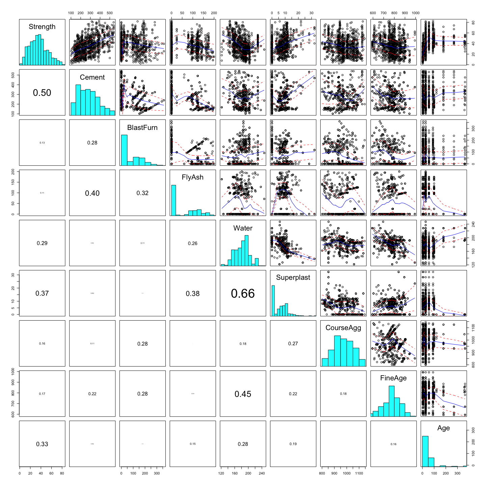

CourseAgg and FineAge are removed, so we do not consider them. Because
they are the most right-skewed, we will consider transforming variables
such as Age, Superplast, FlyAsh, and BlastBurn. We will also look at
Cement, Water, and the resposne Strength to check if the transforming
them would make the distribution look better.

``` r
#Log age
myBC(Concrete.trans$Age)
```

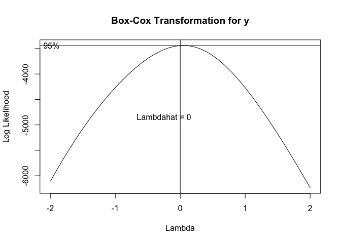

    ## bcPower Transformation to Normality 
    ##   Est Power Rounded Pwr Wald Lwr Bnd Wald Upr Bnd
    ## y     0.049        0.05       0.0042       0.0938
    ## 
    ## Likelihood ratio test that transformation parameter is equal to 0
    ##  (log transformation)
    ##                            LRT df     pval
    ## LR test, lambda = (0) 4.557327  1 0.032778
    ## 
    ## Likelihood ratio test that no transformation is needed
    ##                           LRT df       pval
    ## LR test, lambda = (1) 1663.54  1 < 2.22e-16

``` r
Concrete.trans$Age = log(Concrete.trans$Age)
Statplot(Concrete.trans$Age)
```


Logging it may seems better.

``` r
#lambda .3 for Superplast
myBC(Concrete.trans$Superplast+1)
```

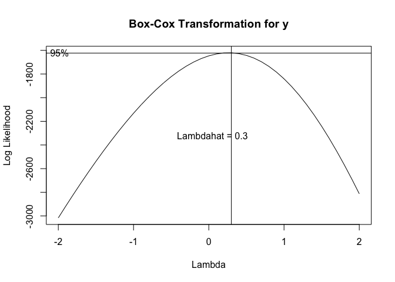

    ## bcPower Transformation to Normality 
    ##   Est Power Rounded Pwr Wald Lwr Bnd Wald Upr Bnd
    ## y    0.2642        0.33       0.1934       0.3349
    ## 
    ## Likelihood ratio test that transformation parameter is equal to 0
    ##  (log transformation)
    ##                            LRT df       pval
    ## LR test, lambda = (0) 51.84316  1 6.0119e-13
    ## 
    ## Likelihood ratio test that no transformation is needed
    ##                            LRT df       pval
    ## LR test, lambda = (1) 439.7912  1 < 2.22e-16

``` r
Concrete.trans$Superplast = yjPower(Concrete.trans$Superplast, 0.3)
Statplot(Concrete.trans$Superplast)
```


``` r
#lambda -0.1 for FlyAsh
myBC(Concrete.trans$FlyAsh+1)
```

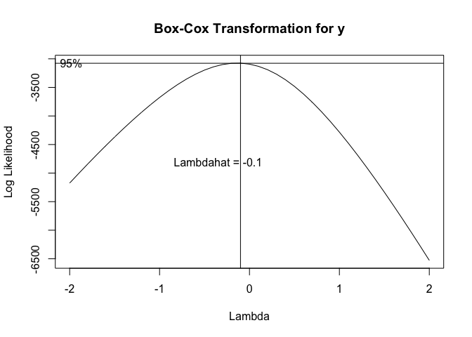

    ## bcPower Transformation to Normality 
    ##   Est Power Rounded Pwr Wald Lwr Bnd Wald Upr Bnd
    ## y   -0.1365       -0.14      -0.1805      -0.0925
    ## 
    ## Likelihood ratio test that transformation parameter is equal to 0
    ##  (log transformation)
    ##                            LRT df       pval
    ## LR test, lambda = (0) 37.53461  1 8.9805e-10
    ## 
    ## Likelihood ratio test that no transformation is needed
    ##                            LRT df       pval
    ## LR test, lambda = (1) 2417.681  1 < 2.22e-16

``` r
Concrete.trans$BlastFurn = yjPower(Concrete.trans$FlyAsh, -0.1)
Statplot(Concrete.trans$FlyAsh)
```


``` r
#lamda = -0.4 for BlastFurn
myBC(Concrete.trans$BlastFurn+1)
```


    ## bcPower Transformation to Normality 
    ##   Est Power Rounded Pwr Wald Lwr Bnd Wald Upr Bnd
    ## y   -0.3893        -0.5      -0.5253      -0.2533
    ## 
    ## Likelihood ratio test that transformation parameter is equal to 0
    ##  (log transformation)
    ##                            LRT df       pval
    ## LR test, lambda = (0) 31.82083  1 1.6907e-08
    ## 
    ## Likelihood ratio test that no transformation is needed
    ##                            LRT df       pval
    ## LR test, lambda = (1) 404.8716  1 < 2.22e-16

``` r
Concrete.trans$BlastFurn = log(Concrete.trans$BlastFurn+1)
Statplot(Concrete.trans$BlastFurn)
```


``` r
#lambda .2
myBC(Concrete.trans$Cement)
```


    ## bcPower Transformation to Normality 
    ##   Est Power Rounded Pwr Wald Lwr Bnd Wald Upr Bnd
    ## y    0.1723        0.33       0.0107       0.3339
    ## 
    ## Likelihood ratio test that transformation parameter is equal to 0
    ##  (log transformation)
    ##                            LRT df     pval
    ## LR test, lambda = (0) 4.373801  1 0.036495
    ## 
    ## Likelihood ratio test that no transformation is needed
    ##                            LRT df       pval
    ## LR test, lambda = (1) 99.09702  1 < 2.22e-16

``` r
Concrete.trans$Cement = bcPower(Concrete.trans$Cement, 0.2)
Statplot(Concrete.trans$Cement)
```


``` r
#water .8
myBC(Concrete.trans$Water)
```


    ## bcPower Transformation to Normality 
    ##   Est Power Rounded Pwr Wald Lwr Bnd Wald Upr Bnd
    ## y    0.8096           1       0.3987       1.2204
    ## 
    ## Likelihood ratio test that transformation parameter is equal to 0
    ##  (log transformation)
    ##                            LRT df       pval
    ## LR test, lambda = (0) 15.08393  1 0.00010283
    ## 
    ## Likelihood ratio test that no transformation is needed
    ##                             LRT df    pval
    ## LR test, lambda = (1) 0.8230891  1 0.36428

``` r
Concrete.trans$Water = bcPower(Concrete.trans$Water, 0.8)
Statplot(Concrete.trans$Water)
```


``` r
#myBC(Concrete.trans$Strength)
#Concrete.trans$Strength = log(Concrete.trans$Strength)
Concrete.trans$Strength = bcPower(Concrete.trans$Strength, 0.6)
Statplot(Concrete.trans$Strength)
```


``` r
#Make sure to take the 0.6th root of the response when predicting on the validation set to have it be back in its original scale
```

<b>lm2.step</b> is the model after removing the CourseAgg and FineAge
predictors. We are going to update the model with the data that we have
applied the above transformations to.

``` r
lm.trans = update(lm2.step, Strength~. , data = Concrete.trans[sam,])
```

``` r
#Plot the lm.trans model to see how it looks like now
par(mfrow=c(2,2))
plot(lm.trans)
```

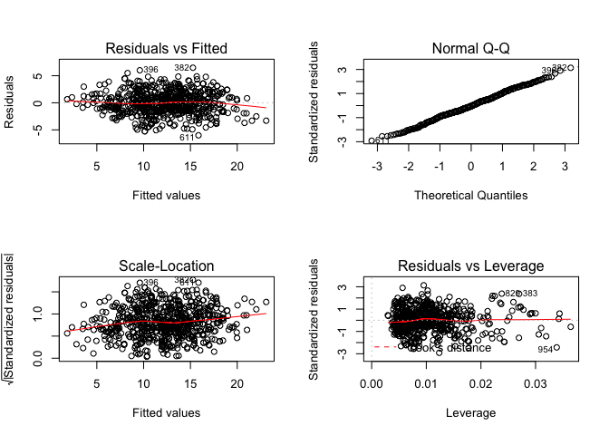
There still seems to be some curvature present in the model. Let’s check
how we are predicting so far:

``` r
##Actual vs. predicted

#Original scale
#invBoxCox(2, 0)
#This function will
```

This function is invBoxCox(transformed, lambda). If we logged a reposne,
we would use the function as such: invBoxCox(ypred, 0) and this would do
the same computation as exp(ypred). Check the function:

``` r
#Transformed
summary(Concrete.trans$Strength)
```

    ##    Min. 1st Qu.  Median    Mean 3rd Qu.    Max. 
    ##   1.102   9.471  12.269  12.199  14.939  21.886

``` r
#Original scale
summary(Concrete$Strength)
```

    ##    Min. 1st Qu.  Median    Mean 3rd Qu.    Max. 
    ##    2.33   23.71   34.45   35.82   46.13   82.60

``` r
check = invBoxCox(Concrete.trans$Strength, 0.6)
summary(check)
```

    ##    Min. 1st Qu.  Median    Mean 3rd Qu.    Max. 
    ##    2.33   23.71   34.45   35.82   46.13   82.60

``` r
summary(Concrete$Strength)
```

    ##    Min. 1st Qu.  Median    Mean 3rd Qu.    Max. 
    ##    2.33   23.71   34.45   35.82   46.13   82.60

Thus, for our case, we took the resposne to the power of lambda = 0.6,
and we will bring it back to the original scale by doing this:

``` r
require(Ecfun)
y = Concrete$Strength[-sam]
ypred = predict(lm.trans, newdata = Concrete.trans[-sam,])
ypred.orig = invBoxCox(ypred, 0.6)
```

``` r
results.trans = PredAcc(y, ypred.orig)
```

    ## RMSEP
    ## ================
    ## 9.322811 
    ## 
    ## MAE
    ## ================
    ## 7.037621 
    ## 
    ## MAPE
    ## ================
    ## 22.87769

``` r
results.trans
```

    ##      RMSEP      MAE     MAPE
    ## 1 9.322811 7.037621 22.87769

``` r
summary(lm.trans)
```

    ## 
    ## Call:
    ## lm(formula = Strength ~ Cement + BlastFurn + FlyAsh + Water + 
    ##     Superplast + Age, data = Concrete.trans[sam, ])
    ## 
    ## Residuals:
    ##     Min      1Q  Median      3Q     Max 
    ## -6.0073 -1.3095 -0.0943  1.3112  6.4732 
    ## 
    ## Coefficients:
    ##              Estimate Std. Error t value Pr(>|t|)    
    ## (Intercept) -5.588259   1.490870  -3.748 0.000193 ***
    ## Cement       1.561681   0.078134  19.987  < 2e-16 ***
    ## BlastFurn    0.124788   0.330590   0.377 0.705941    
    ## FlyAsh      -0.008643   0.004046  -2.136 0.033041 *  
    ## Water       -0.082995   0.014192  -5.848 7.72e-09 ***
    ## Superplast   0.835677   0.069809  11.971  < 2e-16 ***
    ## Age          2.178609   0.068751  31.689  < 2e-16 ***
    ## ---
    ## Signif. codes:  0 '***' 0.001 '**' 0.01 '*' 0.05 '.' 0.1 ' ' 1
    ## 
    ## Residual standard error: 2.073 on 679 degrees of freedom
    ## Multiple R-squared:  0.7461, Adjusted R-squared:  0.7439 
    ## F-statistic: 332.6 on 6 and 679 DF,  p-value: < 2.2e-16

The model is performing better than the original so far with R^2 of
74.61%.

Let’s look at the predictors and their relationships with the resposne
first by using CERES plots:

``` r
#CERES plots with lm2.step
ceresPlots(lm2.step)
```


It seems like Superplast and Age would definitely need some adjustment
for functional form. FlyAsh also seems like it’s having some curvature
there.

Let’s add poly terms one at the time to our lm.trans model

``` r
lm.poly = update(lm.trans, Strength~. + poly(Water, 2))
data.frame(R.sq = c(summary(lm.poly)$r.squared*100), Adj.R.sq=c(summary(lm.poly)$adj.r.squared*100))
```

    ##       R.sq Adj.R.sq
    ## 1 74.63759 74.37574

``` r
lm.poly = update(lm.trans, Strength~. + poly(Age, 3))
data.frame(R.sq = c(summary(lm.poly)$r.squared*100), Adj.R.sq=c(summary(lm.poly)$adj.r.squared)*100)
```

    ##       R.sq Adj.R.sq
    ## 1 75.58042 75.29186

``` r
lm.poly = update(lm.trans, Strength~. + poly(Age, 3) + poly(Water, 2))
data.frame(R.sq = c(summary(lm.poly)$r.squared*100), Adj.R.sq=c(summary(lm.poly)$adj.r.squared)*100)
```

    ##      R.sq Adj.R.sq
    ## 1 75.7428 75.41985

``` r
lm.poly = update(lm.trans, Strength~. + poly(Superplast, 2))
data.frame(R.sq = c(summary(lm.poly)$r.squared*100), Adj.R.sq=c(summary(lm.poly)$adj.r.squared)*100)
```

    ##      R.sq Adj.R.sq
    ## 1 76.3248 76.08037

However, just by adding a Superplast polynomial degree=2, the R^2 went
up. Also, let’s look at the significance of the predictors in this model
by looking at the p-values:

``` r
summary(lm.poly)
```

    ## 
    ## Call:
    ## lm(formula = Strength ~ Cement + BlastFurn + FlyAsh + Water + 
    ##     Superplast + Age + poly(Superplast, 2), data = Concrete.trans[sam, 
    ##     ])
    ## 
    ## Residuals:
    ##     Min      1Q  Median      3Q     Max 
    ## -5.8008 -1.3070 -0.1437  1.3144  6.2337 
    ## 
    ## Coefficients: (1 not defined because of singularities)
    ##                        Estimate Std. Error t value Pr(>|t|)    
    ## (Intercept)           -4.895104   1.444246  -3.389 0.000741 ***
    ## Cement                 1.628079   0.076106  21.392  < 2e-16 ***
    ## BlastFurn             -0.470555   0.330631  -1.423 0.155137    
    ## FlyAsh                -0.006571   0.003922  -1.675 0.094301 .  
    ## Water                 -0.098429   0.013892  -7.086 3.48e-12 ***
    ## Superplast             0.902099   0.068131  13.241  < 2e-16 ***
    ## Age                    2.179759   0.066444  32.806  < 2e-16 ***
    ## poly(Superplast, 2)1         NA         NA      NA       NA    
    ## poly(Superplast, 2)2 -16.663141   2.381242  -6.998 6.26e-12 ***
    ## ---
    ## Signif. codes:  0 '***' 0.001 '**' 0.01 '*' 0.05 '.' 0.1 ' ' 1
    ## 
    ## Residual standard error: 2.004 on 678 degrees of freedom
    ## Multiple R-squared:  0.7632, Adjusted R-squared:  0.7608 
    ## F-statistic: 312.3 on 7 and 678 DF,  p-value: < 2.2e-16

Water and FlyAsh are not significant right now. But let’s keep going and
check with some more polies.

``` r
lm.poly = update(lm.trans, Strength~. + poly(Superplast, 2) + poly(Age,3))
data.frame(R.sq = c(summary(lm.poly)$r.squared*100), Adj.R.sq=c(summary(lm.poly)$adj.r.squared)*100)
```

    ##       R.sq Adj.R.sq
    ## 1 76.93469  76.6276

``` r
lm.poly = update(lm.trans, Strength~. + poly(Superplast, 2) + poly(Age,3) + poly(Water, 2))
data.frame(R.sq = c(summary(lm.poly)$r.squared*100), Adj.R.sq=c(summary(lm.poly)$adj.r.squared)*100)
```

    ##       R.sq Adj.R.sq
    ## 1 77.37653 77.04137

Plus in this model, FlyAsh has a significant p-value. So only Water is
not a significant predictor right now.

``` r
lm.poly = update(lm.trans, Strength~. + poly(Superplast, 2) + poly(Age,3) + poly(Water, 2) + poly(FlyAsh, 2))
data.frame(R.sq = c(summary(lm.poly)$r.squared*100), Adj.R.sq=c(summary(lm.poly)$adj.r.squared)*100)
```

    ##      R.sq Adj.R.sq
    ## 1 77.3773 77.00808

Now, adding FlyAsh made the adjusted R^2 go down - FlyAsh poly does not
benefit this model.

``` r
lm.poly = update(lm.trans, Strength~. + poly(Superplast, 2) + poly(FlyAsh, 2))
data.frame(R.sq = c(summary(lm.poly)$r.squared*100), Adj.R.sq=c(summary(lm.poly)$adj.r.squared)*100)
```

    ##       R.sq Adj.R.sq
    ## 1 76.32822 76.04849

And just by having FlyAsh and Superplast polies by themselves does not
make the model explain more variation.

We are going to keep the following polies:

-   Age, degree=3 and Water, degree=2 and Superplast, degree=2

``` r
lm.poly = update(lm.trans, Strength~. + poly(Superplast, 2) + poly(Age,3) + poly(Water, 2))
data.frame(R.sq = c(summary(lm.poly)$r.squared*100), Adj.R.sq=c(summary(lm.poly)$adj.r.squared)*100)
```

    ##       R.sq Adj.R.sq
    ## 1 77.37653 77.04137

``` r
summary(lm.poly)
```

    ## 
    ## Call:
    ## lm(formula = Strength ~ Cement + BlastFurn + FlyAsh + Water + 
    ##     Superplast + Age + poly(Superplast, 2) + poly(Age, 3) + poly(Water, 
    ##     2), data = Concrete.trans[sam, ])
    ## 
    ## Residuals:
    ##     Min      1Q  Median      3Q     Max 
    ## -5.6960 -1.2989 -0.0687  1.3203  5.9388 
    ## 
    ## Coefficients: (3 not defined because of singularities)
    ##                        Estimate Std. Error t value Pr(>|t|)    
    ## (Intercept)           -4.285272   1.444184  -2.967 0.003111 ** 
    ## Cement                 1.616544   0.075322  21.462  < 2e-16 ***
    ## BlastFurn             -0.392323   0.324433  -1.209 0.226988    
    ## FlyAsh                -0.007794   0.003855  -2.022 0.043617 *  
    ## Water                 -0.099745   0.013740  -7.259 1.07e-12 ***
    ## Superplast             0.807397   0.068891  11.720  < 2e-16 ***
    ## Age                    2.125427   0.066313  32.051  < 2e-16 ***
    ## poly(Superplast, 2)1         NA         NA      NA       NA    
    ## poly(Superplast, 2)2 -16.891127   2.419334  -6.982 6.99e-12 ***
    ## poly(Age, 3)1                NA         NA      NA       NA    
    ## poly(Age, 3)2         -9.148240   2.119633  -4.316 1.83e-05 ***
    ## poly(Age, 3)3         -5.563960   2.021774  -2.752 0.006082 ** 
    ## poly(Water, 2)1              NA         NA      NA       NA    
    ## poly(Water, 2)2        7.879352   2.170116   3.631 0.000304 ***
    ## ---
    ## Signif. codes:  0 '***' 0.001 '**' 0.01 '*' 0.05 '.' 0.1 ' ' 1
    ## 
    ## Residual standard error: 1.963 on 675 degrees of freedom
    ## Multiple R-squared:  0.7738, Adjusted R-squared:  0.7704 
    ## F-statistic: 230.9 on 10 and 675 DF,  p-value: < 2.2e-16

Now, we need to adjust for the NA of some repetitive predictors in the
model: Superplast is the same as poly(Superplast, 2)1; Age is the same
as poly(Age, 3)1; and Water is the same as poly(Water, 2)1.

``` r
lm.poly.2 = step(lm.poly)
```

    ## Start:  AIC=936.34
    ## Strength ~ Cement + BlastFurn + FlyAsh + Water + Superplast + 
    ##     Age + poly(Superplast, 2) + poly(Age, 3) + poly(Water, 2)
    ## 
    ## 
    ## Step:  AIC=936.34
    ## Strength ~ Cement + BlastFurn + FlyAsh + Water + Superplast + 
    ##     poly(Superplast, 2) + poly(Age, 3) + poly(Water, 2)
    ## 
    ## 
    ## Step:  AIC=936.34
    ## Strength ~ Cement + BlastFurn + FlyAsh + Water + poly(Superplast, 
    ##     2) + poly(Age, 3) + poly(Water, 2)
    ## 
    ## 
    ## Step:  AIC=936.34
    ## Strength ~ Cement + BlastFurn + FlyAsh + poly(Superplast, 2) + 
    ##     poly(Age, 3) + poly(Water, 2)
    ## 
    ##                       Df Sum of Sq    RSS     AIC
    ## - BlastFurn            1       5.6 2606.8  935.82
    ## <none>                             2601.2  936.34
    ## - FlyAsh               1      15.7 2617.0  938.48
    ## - poly(Water, 2)       2     234.4 2835.6  991.52
    ## - poly(Superplast, 2)  2     648.3 3249.5 1084.99
    ## - Cement               1    1775.0 4376.2 1291.20
    ## - poly(Age, 3)         3    4161.7 6762.9 1585.79
    ## 
    ## Step:  AIC=935.82
    ## Strength ~ Cement + FlyAsh + poly(Superplast, 2) + poly(Age, 
    ##     3) + poly(Water, 2)
    ## 
    ##                       Df Sum of Sq    RSS     AIC
    ## <none>                             2606.8  935.82
    ## - FlyAsh               1     199.9 2806.7  984.49
    ## - poly(Water, 2)       2     239.0 2845.8  992.00
    ## - poly(Superplast, 2)  2     674.7 3281.5 1089.72
    ## - Cement               1    1780.4 4387.3 1290.93
    ## - poly(Age, 3)         3    4170.9 6777.8 1585.30

``` r
lm.poly.2$anova
```

    ##           Step Df     Deviance Resid. Df Resid. Dev      AIC
    ## 1              NA           NA       675   2601.202 936.3360
    ## 2        - Age  0 8.185452e-12       675   2601.202 936.3360
    ## 3 - Superplast  0 4.547474e-13       675   2601.202 936.3360
    ## 4      - Water  0 3.183231e-12       675   2601.202 936.3360
    ## 5  - BlastFurn  1 5.635166e+00       676   2606.837 935.8205

But Superplast, Water, and Age stayed in as polies of first degree - as
mentioned above, they are they were representing the same terms.

Let’s check back how we are predicting so far:

``` r
require(Ecfun)
y = Concrete$Strength[-sam]
ypred = predict(lm.poly.2, newdata = Concrete.trans[-sam,])
ypred.orig = invBoxCox(ypred, 0.6)
```

``` r
results.trans
```

    ##      RMSEP      MAE     MAPE
    ## 1 9.322811 7.037621 22.87769

``` r
results.poly
```

    ##    RMSEP      MAE     MAPE
    ## 1 8.7673 6.861779 22.24517

With the polynomials added to our model, all of our prediction accuracy
metrics went down. Great so far.

Lastly, let’s consider ACE/AVAS and confirm if the transformations we
did so far are in fact the recomended ones. We are going to choose AVAS
because it is better and agrees with the analyses we conducted with
Box-Cox and CERES plots.

``` r
require(acepack)
```

    ## Loading required package: acepack

``` r
Concrete.ace_avas = Concrete
```

``` r
#Create X matrix of all predictors and y vector of the response
X = model.matrix(Strength~., data =Concrete.ace_avas)[,-1]
```

``` r
y = Concrete.ace_avas$Strength
ace = ace(X,y)
#par(mfrow=c(4,4))
maceplot(X,y,ace)
```

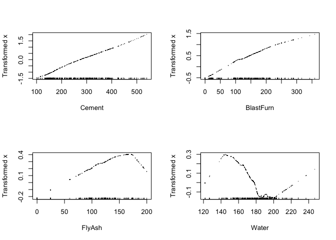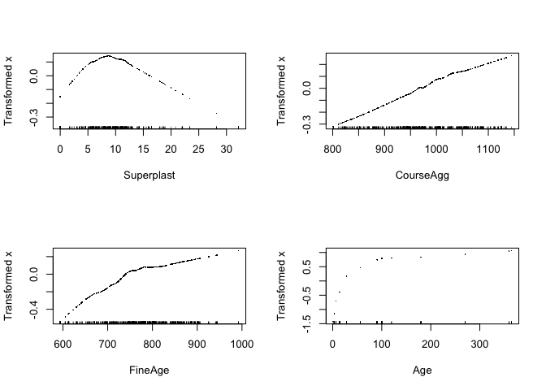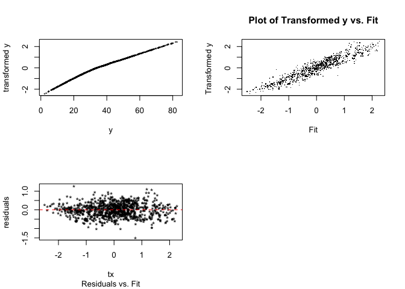

FineAge and CourseAgg were removed with the stepwise at the begining.
Age, SuperPlast, and Water graphs do show needed transformations. Water
looks like a cubic here; FlyAsh like a quadratic; and Age like a square
root.

Let’s look at AVAS - which is usually more adept than ACE at finding the
optimal transformations.

``` r
require(acepack)
avas = avas(X,y)
maceplot(X,y,avas)
```

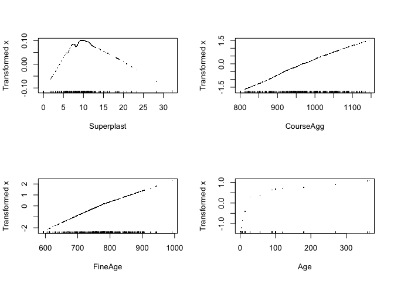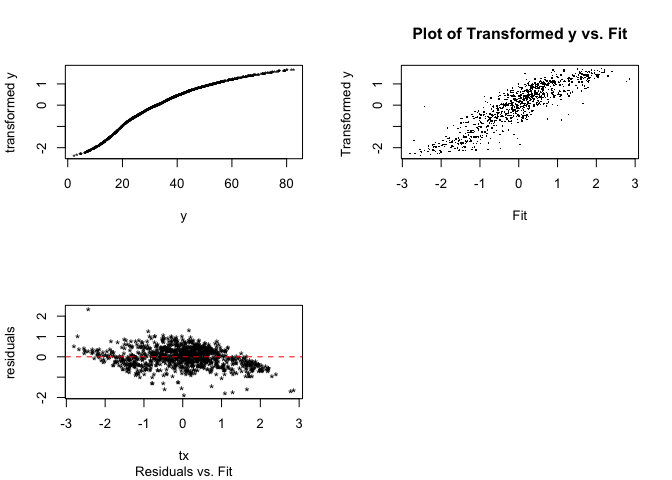

By looking at the plots results from AVAS, it seems like Water should
have, after all, a quadriatic transformation; FlyAsh, Cement, and
BlastFurn are very close to linear - so we are not going to be changing
their functional forms; Superplast seems quadriatic; and Age once again
seems like a square root. These transformations seem to check out with
what we inferred from CERES plots and Box-Cox power transformations.

Our results from the final model are: <b> lm.poly2 </b>

R^2 from training:

``` r
summary(lm.poly.2)$r.squared*100
```

    ## [1] 77.32752

R^2 from predicting validation set:

``` r
summary(update(lm.poly.2, Strength~., data = Concrete.trans[-sam,]))$r.squared*100
```

    ## [1] 75.16345

Prediction Accuracy metrics:

``` r
results.poly
```

    ##    RMSEP      MAE     MAPE
    ## 1 8.7673 6.861779 22.24517

PART D
------

Fit a MARS model to the training data with degree = 1 (i.e. no
interactions). Use the internal cross-validation features of the earth()
function to choose the “best” MARS model with degree = 1. Again predict
the compression strength of the concrete samples in the validation set
in the original scale and compute RMSEP, MAEP, and MAPEP. How does this
compare to the models in part (a) and (c)? (10 pts.)

We will use our variable transformed dataset.

``` r
#install.packages("earth")
require(earth)
```

    ## Loading required package: earth

    ## Loading required package: Formula

    ## Loading required package: plotmo

    ## Loading required package: plotrix

    ## Loading required package: TeachingDemos

``` r
Concrete.mars = earth(Strength~.,data = Concrete.trans[sam,], degree = 1 )
plot(Concrete.mars)
```

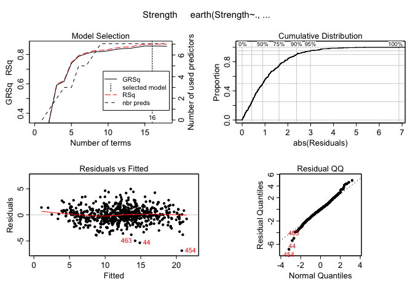

``` r
plotmo(Concrete.mars)
```

    ##  plotmo grid:    Cement BlastFurn FlyAsh   Water Superplast CourseAgg
    ##                10.37688         0      0 79.8021   2.767612       968
    ##  FineAge      Age
    ##    779.3 3.332205


``` r
summary(Concrete.mars)
```

    ## Call: earth(formula=Strength~., data=Concrete.trans[sam,], degree=1)
    ## 
    ##                       coefficients
    ## (Intercept)               44.98765
    ## h(10.1023-Cement)         -1.39049
    ## h(Cement-10.1023)          0.86871
    ## h(1.61584-BlastFurn)       0.86224
    ## h(BlastFurn-1.61584)    -335.91117
    ## h(Water-64.1823)          -0.99725
    ## h(84.3518-Water)          -0.60879
    ## h(Water-84.3518)           0.96606
    ## h(Superplast-1.9354)      -1.49568
    ## h(3.79503-Superplast)     -0.93534
    ## h(1118.8-CourseAgg)        0.01563
    ## h(CourseAgg-1118.8)        0.07881
    ## h(FineAge-614)            -0.25340
    ## h(652-FineAge)            -0.21101
    ## h(FineAge-652)             0.23684
    ## h(4.51086-Age)            -2.36132
    ## 
    ## Selected 16 of 18 terms, and 7 of 8 predictors
    ## Termination condition: Reached nk 21
    ## Importance: Age, Cement, Water, CourseAgg, FineAge, Superplast, ...
    ## Number of terms at each degree of interaction: 1 15 (additive model)
    ## GCV 2.401118    RSS 1501.662    GRSq 0.8571581    RSq 0.8693958

Upon a quick runthrought of the Mars Method, we selected 16 terms from 8
predictors and got a GRSq of 0.857, which is impressive compared to the
time required to due a more traditional Multiple Linear regression in
order to achieve similar results. Still, we have yet to check the model
using internal Cross-validation methods or after adjusting paramters, so
we aren’t done yet.

``` r
Concrete.mars = earth(Strength~.,data = Concrete.trans[sam,], degree = 1, keepxy = T, nfold = 10, ncross = 30 )

plot(Concrete.mars)
```


Based on 10 Kfolds, crossing 30 times, we seem to picking from 16 to 19
terms for our model when degree is 1, which is similar to our intial. We
also should look at how variables are contributing to the model, just to
make sure nothing seems out of wack.

``` r
evimp(Concrete.mars, trim = FALSE)
```

    ##               nsubsets   gcv    rss
    ## Age                 15 100.0  100.0
    ## Cement              14  76.6   76.7
    ## Water               12  40.8   41.7
    ## CourseAgg           11  37.0   37.7
    ## FineAge             11  37.0   37.7
    ## Superplast           9  43.5>  43.8>
    ## BlastFurn            9  24.8   25.9
    ## FlyAsh-unused        0   0.0    0.0

As indicated by the summary, all but one of the variables are used. This
is intereting given what we learned through our MLR efforts, as
CourseAgg tended to be a poor predictor simply in general and was decied
to be left out for those models as well. Otherwise, like we found
earlier age and cement seem to be big ticket contributors, while
superplasta and flyash are weaker as indivdals. Although we should note
that water is much more effective here, likely due to its structure
being more akin to mappign vai checkmar functions than linear models
with polynomial terms.

For the sake of being thorough, we will also attempt this process again
after goading the model to utilize less variables to see if it has any
effect on the GRSq. Due to it already using almost everything, it makes
little sense to force more, but a simpler model may potentially prove
more effective. However, given what we know about out variables thus
far, it seems unlikely that much success will be found as truncating
from seven likely decrease our model.

``` r
Concrete.mars2 = earth(Strength~.,data = Concrete.trans[sam,], degree = 1, nprune = 5, nfold = 10, keepxy = T, ncross = 30 )
plot(Concrete.mars2)
```

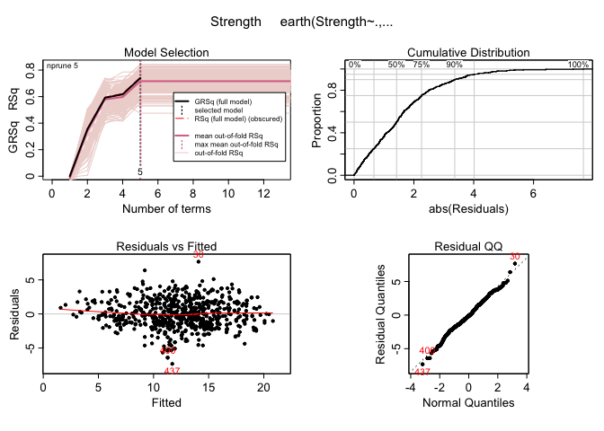

``` r
plotmo(Concrete.mars2)
```

    ##  plotmo grid:    Cement BlastFurn FlyAsh   Water Superplast CourseAgg
    ##                10.37688         0      0 79.8021   2.767612       968
    ##  FineAge      Age
    ##    779.3 3.332205

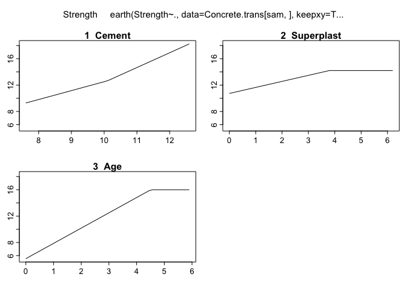

``` r
summary(Concrete.mars2)
```

    ## Call: earth(formula=Strength~., data=Concrete.trans[sam,], keepxy=T,
    ##             degree=1, nprune=5, nfold=10, ncross=30)
    ## 
    ##                       coefficients
    ## (Intercept)             16.3226123
    ## h(10.1023-Cement)       -1.3500764
    ## h(Cement-10.1023)        2.2426498
    ## h(3.79503-Superplast)   -0.9152549
    ## h(4.51086-Age)          -2.3178730
    ## 
    ## Selected 5 of 18 terms, and 3 of 8 predictors
    ## Termination condition: Reached nk 21
    ## Importance: Age, Cement, Superplast, Water-unused, BlastFurn-unused, ...
    ## Number of terms at each degree of interaction: 1 4 (additive model)
    ## GCV 4.373979  RSS 2922.334  GRSq 0.7397931  RSq 0.7458354  CVRSq 0.8402712
    ## 
    ## Note: the cross-validation sd's below are standard deviations across folds
    ## 
    ## Cross validation:   nterms 16.17 sd 0.85    nvars 7.46 sd 0.50
    ## 
    ##      CVRSq    sd     MaxErr   sd
    ##       0.84 0.042      -9.48 5.22

``` r
evimp(Concrete.mars2, trim = FALSE)
```

    ##                  nsubsets   gcv    rss
    ## Age                     4 100.0  100.0
    ## Cement                  3  72.2   72.1
    ## Superplast              1  40.7   40.5
    ## Water-unused            1  18.6   19.2
    ## BlastFurn-unused        0   0.0    0.0
    ## FlyAsh-unused           0   0.0    0.0
    ## CourseAgg-unused        0   0.0    0.0
    ## FineAge-unused          0   0.0    0.0

As expected, our GRSq lowered by a little over .10, as well as other
similar measures. While our k-fold cross validation does more concretly
setttle on a specific nunmber of terms (5), the massive loss in
predictive ability likely isn’t worth it.

Overall, while minor gains have been made in our favored metrics, it was
decided that these small improvments were not worth taking hits to the
conistancy, therefore the inital model was chosen despite some of its
less desireable features.

``` r
#Predict
ypredtransformed = predict(Concrete.mars, newdata = Concrete.trans[-sam,])
ypred = invBoxCox(ypredtransformed, 0.6)
#ypred = ypredtransformed^(1/0.6)
PredAcc(Concrete[-sam,]$Strength, ypred)
```

    ## RMSEP
    ## ================
    ## 6.93158 
    ## 
    ## MAE
    ## ================
    ## 5.271546 
    ## 
    ## MAPE
    ## ================
    ## 17.40764

    ##     RMSEP      MAE     MAPE
    ## 1 6.93158 5.271546 17.40764

RMSEP = 6.92 MAE = 5.27 MAPE = 17.41%

R^2 from training:

``` r
summary(Concrete.mars)
```

    ## Call: earth(formula=Strength~., data=Concrete.trans[sam,], keepxy=T,
    ##             degree=1, nfold=10, ncross=30)
    ## 
    ##                       coefficients
    ## (Intercept)               44.98765
    ## h(10.1023-Cement)         -1.39049
    ## h(Cement-10.1023)          0.86871
    ## h(1.61584-BlastFurn)       0.86224
    ## h(BlastFurn-1.61584)    -335.91117
    ## h(Water-64.1823)          -0.99725
    ## h(84.3518-Water)          -0.60879
    ## h(Water-84.3518)           0.96606
    ## h(Superplast-1.9354)      -1.49568
    ## h(3.79503-Superplast)     -0.93534
    ## h(1118.8-CourseAgg)        0.01563
    ## h(CourseAgg-1118.8)        0.07881
    ## h(FineAge-614)            -0.25340
    ## h(652-FineAge)            -0.21101
    ## h(FineAge-652)             0.23684
    ## h(4.51086-Age)            -2.36132
    ## 
    ## Selected 16 of 18 terms, and 7 of 8 predictors
    ## Termination condition: Reached nk 21
    ## Importance: Age, Cement, Water, CourseAgg, FineAge, Superplast, ...
    ## Number of terms at each degree of interaction: 1 15 (additive model)
    ## GCV 2.401118  RSS 1501.662  GRSq 0.8571581  RSq 0.8693958  CVRSq 0.8418
    ## 
    ## Note: the cross-validation sd's below are standard deviations across folds
    ## 
    ## Cross validation:   nterms 16.14 sd 0.87    nvars 7.43 sd 0.50
    ## 
    ##      CVRSq   sd     MaxErr   sd
    ##      0.842 0.04      -9.62 5.23

R^2 from training: 86.94%

R^2 from predicting validation set:

``` r
summary(update(Concrete.mars, Strength~., data = Concrete.trans[-sam,]))
```

    ## Call:
    ##             earth(formula=Strength~Cement+BlastFurn+FlyAsh+Water+Superplast+...),
    ##             data=Concrete.trans[-sam,], keepxy=T, degree=1, nfold=10,
    ##             ncross=30)
    ## 
    ##                       coefficients
    ## (Intercept)             19.6792088
    ## h(10.6954-Cement)       -0.9844564
    ## h(Cement-10.6954)        1.2192013
    ## h(173.5-FlyAsh)          0.0112272
    ## h(FlyAsh-173.5)         -0.2236732
    ## h(Water-65.6282)        -0.3171435
    ## h(Water-89.3563)         0.3366837
    ## h(3.58418-Superplast)   -0.3875986
    ## h(Superplast-3.58418)   -1.4507915
    ## h(1111.6-CourseAgg)      0.0140383
    ## h(CourseAgg-1111.6)      0.1047891
    ## h(664.3-FineAge)        -0.0266744
    ## h(FineAge-664.3)        -0.0964341
    ## h(FineAge-688)           0.0817412
    ## h(4.02535-Age)          -2.1974409
    ## h(Age-4.02535)           2.4389689
    ## h(Age-4.60517)          -3.0970676
    ## 
    ## Selected 17 of 18 terms, and 7 of 8 predictors
    ## Termination condition: Reached nk 21
    ## Importance: Age, Cement, Water, FineAge, CourseAgg, FlyAsh, ...
    ## Number of terms at each degree of interaction: 1 16 (additive model)
    ## GCV 3.036011  RSS 853.6221  GRSq 0.8165205  RSq 0.8491588  CVRSq 0.7825785
    ## 
    ## Note: the cross-validation sd's below are standard deviations across folds
    ## 
    ## Cross validation:   nterms 15.52 sd 0.87    nvars 7.62 sd 0.49
    ## 
    ##      CVRSq    sd     MaxErr   sd
    ##      0.783 0.082       -8.4 4.36

R^2 from validation set: 84.92%

PART E
------

Fit a MARS model to the training with degree = 2 (i.e. including
potential interactions). Again use the internal cross-validation
capabilities of the earth() function to choose the best degree = 2 MARS
model for these data. Again predict the compression strength of the
concrete samples in the validation set in the original scale and compute
RMSEP, MAEP, and MAPEP. How does this compare to the earlier models?
Which predictors seem most important for predicting strength? (10 pts.)

Next, we will try with degree 2, allowing interactions to be considered.

``` r
Concrete.mars.deg2 = earth(Strength~.,data = Concrete.trans[sam,], degree = 2, keepxy = T, nfold = 10, ncross = 30 )

plot(Concrete.mars.deg2)
```


Across 30 run-throughs, it seems to sway between 17 and 19 terms.

``` r
plotmo(Concrete.mars.deg2)
```

    ##  plotmo grid:    Cement BlastFurn FlyAsh   Water Superplast CourseAgg
    ##                10.37688         0      0 79.8021   2.767612       968
    ##  FineAge      Age
    ##    779.3 3.332205


``` r
summary(Concrete.mars.deg2)
```

    ## Call: earth(formula=Strength~., data=Concrete.trans[sam,], keepxy=T,
    ##             degree=2, nfold=10, ncross=30)
    ## 
    ##                                           coefficients
    ## (Intercept)                                  13.494700
    ## h(10.1023-Cement)                            -1.911947
    ## h(Cement-10.1023)                             1.423760
    ## h(1.61584-BlastFurn)                          0.645982
    ## h(BlastFurn-1.61584)                       -283.420391
    ## h(91.5772-Water)                              0.220552
    ## h(Water-91.5772)                              0.309281
    ## h(3.79503-Superplast)                        -0.738698
    ## h(Superplast-3.79503)                        -1.345565
    ## h(1125-CourseAgg)                             0.008867
    ## h(CourseAgg-1125)                             0.280067
    ## h(614-FineAge)                               -0.299200
    ## h(FineAge-614)                               -0.010863
    ## h(4.51086-Age)                               -2.330198
    ## h(12.1518-Cement) * h(3.79503-Superplast)     0.257772
    ## h(Cement-12.1518) * h(3.79503-Superplast)     2.258980
    ## h(3.79503-Superplast) * h(CourseAgg-1047)    -0.008977
    ## h(3.79503-Superplast) * h(FineAge-652)       -0.002130
    ## h(3.79503-Superplast) * h(652-FineAge)        0.013634
    ## 
    ## Selected 19 of 21 terms, and 7 of 8 predictors
    ## Termination condition: Reached nk 21
    ## Importance: Age, Cement, Water, CourseAgg, FineAge, Superplast, ...
    ## Number of terms at each degree of interaction: 1 13 5
    ## GCV 2.517786  RSS 1503.331  GRSq 0.8502175  RSq 0.8692506  CVRSq 0.8362127
    ## 
    ## Note: the cross-validation sd's below are standard deviations across folds
    ## 
    ## Cross validation:   nterms 17.65 sd 1.16    nvars 7.02 sd 0.14
    ## 
    ##      CVRSq    sd     MaxErr   sd
    ##      0.836 0.044       10.2 5.15

``` r
evimp(Concrete.mars.deg2, trim = FALSE)
```

    ##               nsubsets   gcv    rss
    ## Age                 18 100.0  100.0
    ## Cement              17  76.5   76.7
    ## Water               15  40.9   42.3
    ## CourseAgg           14  36.3   37.7
    ## FineAge             14  36.3   37.7
    ## Superplast          12  43.2>  43.9>
    ## BlastFurn           12  24.9   26.9
    ## FlyAsh-unused        0   0.0    0.0

With a GRSq of just of 0.841, with interaction, we get a slightly worse
model. We also are using less variables, despite there being more terms
used. CourseAgg being removed makes sense, as it was not very useful in
MLR and had a structure that was difficult to work with.

Overall, adding interaction did not make a huge difference in our
model’s performance, however we may be able to widen the gap a bit if we
adjust some parameters.

``` r
Concrete.mars2.deg2 = earth(Strength~.,data = Concrete.trans[sam,], degree = 2, keepxy = T, nfold = 10, ncross = 30 , nk = 30, nprune = 10)

plot(Concrete.mars2.deg2)
```

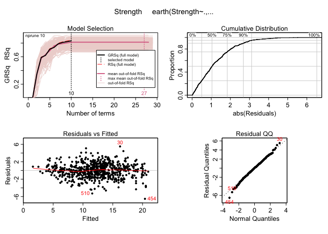

``` r
plotmo(Concrete.mars2.deg2)
```

    ##  plotmo grid:    Cement BlastFurn FlyAsh   Water Superplast CourseAgg
    ##                10.37688         0      0 79.8021   2.767612       968
    ##  FineAge      Age
    ##    779.3 3.332205


``` r
summary(Concrete.mars2.deg2)
```

    ## Call: earth(formula=Strength~., data=Concrete.trans[sam,], keepxy=T,
    ##             degree=2, nprune=10, nfold=10, ncross=30, nk=30)
    ## 
    ##                                          coefficients
    ## (Intercept)                                11.3542062
    ## h(10.1023-Cement)                          -1.1829257
    ## h(Cement-10.1023)                           1.1522480
    ## h(91.5772-Water)                            0.3711850
    ## h(Superplast-3.79503)                      -1.7535589
    ## h(1125-CourseAgg)                           0.0161930
    ## h(4.51086-Age)                             -2.3776162
    ## h(1.32616-BlastFurn) * h(FineAge-614)      -0.0135069
    ## h(BlastFurn-1.32616) * h(FineAge-614)      -0.0869214
    ## h(66.2192-Water) * h(3.79503-Superplast)   -0.6635553
    ## 
    ## Selected 10 of 29 terms, and 7 of 8 predictors
    ## Termination condition: Reached nk 30
    ## Importance: Age, Cement, Water, BlastFurn, CourseAgg, FineAge, ...
    ## Number of terms at each degree of interaction: 1 6 3
    ## GCV 2.825437  RSS 1807.729  GRSq 0.8319155  RSq 0.8427762  CVRSq 0.8590087
    ## 
    ## Note: the cross-validation sd's below are standard deviations across folds
    ## 
    ## Cross validation:   nterms 22.15 sd 1.41    nvars 7.24 sd 0.43
    ## 
    ##      CVRSq    sd     MaxErr   sd
    ##      0.859 0.043      -10.2 5.28

``` r
evimp(Concrete.mars2.deg2, trim = FALSE)
```

    ##               nsubsets   gcv    rss
    ## Age                  9 100.0  100.0
    ## Cement               8  75.9   75.8
    ## Water                6  50.9   51.0
    ## BlastFurn            4  33.9   33.9
    ## CourseAgg            4  33.9   33.9
    ## FineAge              4  33.9   33.9
    ## Superplast           3  24.2   24.7
    ## FlyAsh-unused        0   0.0    0.0

Pruning at 10 and leaving a max terms of 30 gives us an ultimatley
weaker model, although we have manged to remain with measures above 0.8
whilst only using 10 terms. However, we the amount of varition across
folds is astounding with anywhere from 10 to 29 terms being used from
run-through to run-through. Due to such inconsistancy, this iteration
will likely be shelved.

Next we’ll try using no prunes but forcing a higher minimum, though this
may risk overfitting the model.

``` r
Concrete.mars3.deg2 = earth(Strength~.,data = Concrete.trans[sam,], degree = 2, keepxy = T, nfold = 10, ncross = 30 , nk = 25)

summary(Concrete.mars3.deg2)
```

    ## Call: earth(formula=Strength~., data=Concrete.trans[sam,], keepxy=T,
    ##             degree=2, nfold=10, ncross=30, nk=25)
    ## 
    ##                                             coefficients
    ## (Intercept)                                    11.274754
    ## h(10.1023-Cement)                              -1.738902
    ## h(Cement-10.1023)                               1.118083
    ## h(1.61584-BlastFurn)                            0.847676
    ## h(BlastFurn-1.61584)                         -261.679959
    ## h(91.5772-Water)                                0.337417
    ## h(Water-91.5772)                                0.264352
    ## h(Superplast-3.79503)                          -1.655759
    ## h(1125-CourseAgg)                               0.012184
    ## h(CourseAgg-1125)                               0.257004
    ## h(614-FineAge)                                 -0.304775
    ## h(FineAge-614)                                 -0.014447
    ## h(4.51086-Age)                                 -2.319247
    ## h(12.1518-Cement) * h(3.79503-Superplast)       0.171076
    ## h(Cement-12.1518) * h(3.79503-Superplast)       1.909270
    ## h(1.61584-BlastFurn) * h(1.9354-Superplast)    -1.041273
    ## h(66.2192-Water) * h(3.79503-Superplast)       -0.664159
    ## h(Water-66.2192) * h(3.79503-Superplast)        0.025977
    ## h(3.79503-Superplast) * h(CourseAgg-1047)      -0.006367
    ## h(3.79503-Superplast) * h(FineAge-652)         -0.001374
    ## h(3.79503-Superplast) * h(652-FineAge)          0.012714
    ## 
    ## Selected 21 of 25 terms, and 7 of 8 predictors
    ## Termination condition: Reached nk 25
    ## Importance: Age, Cement, Water, FineAge, CourseAgg, BlastFurn, ...
    ## Number of terms at each degree of interaction: 1 12 8
    ## GCV 2.238803  RSS 1315.949  GRSq 0.8668142  RSq 0.8855478  CVRSq 0.8508196
    ## 
    ## Note: the cross-validation sd's below are standard deviations across folds
    ## 
    ## Cross validation:   nterms 19.91 sd 1.20    nvars 7.07 sd 0.25
    ## 
    ##      CVRSq    sd     MaxErr  sd
    ##      0.851 0.041       9.66 5.2

``` r
evimp(Concrete.mars3.deg2, trim = FALSE)
```

    ##               nsubsets   gcv    rss
    ## Age                 20 100.0  100.0
    ## Cement              19  77.0   77.2
    ## Water               18  56.5   57.2
    ## FineAge             17  53.3   53.9
    ## CourseAgg           16  45.2   45.9
    ## BlastFurn           15  32.1   33.6
    ## Superplast          14  30.9   32.3
    ## FlyAsh-unused        0   0.0    0.0

``` r
plot(Concrete.mars3.deg2)
```

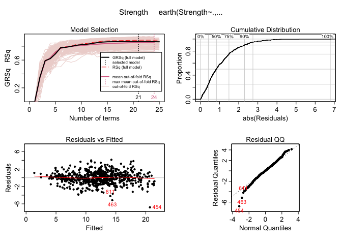
When forcing a higher minimum term count, we get a model with the best
GRSq yet at about 0.861 that hovers between 15 and 25. Once again, it
suffers from inconsistany, which is a considerable negative. for the
next iteration, we will try this same model but re-add in nprune to seee
if less greed can increase it further.

``` r
Concrete.mars4.deg2 = earth(Strength~.,data = Concrete.trans[sam,], degree = 2, keepxy = T, nfold = 10, ncross = 30 , nk = 25, nprune = 21)

summary(Concrete.mars4.deg2)
```

    ## Call: earth(formula=Strength~., data=Concrete.trans[sam,], keepxy=T,
    ##             degree=2, nprune=21, nfold=10, ncross=30, nk=25)
    ## 
    ##                                             coefficients
    ## (Intercept)                                    11.274754
    ## h(10.1023-Cement)                              -1.738902
    ## h(Cement-10.1023)                               1.118083
    ## h(1.61584-BlastFurn)                            0.847676
    ## h(BlastFurn-1.61584)                         -261.679959
    ## h(91.5772-Water)                                0.337417
    ## h(Water-91.5772)                                0.264352
    ## h(Superplast-3.79503)                          -1.655759
    ## h(1125-CourseAgg)                               0.012184
    ## h(CourseAgg-1125)                               0.257004
    ## h(614-FineAge)                                 -0.304775
    ## h(FineAge-614)                                 -0.014447
    ## h(4.51086-Age)                                 -2.319247
    ## h(12.1518-Cement) * h(3.79503-Superplast)       0.171076
    ## h(Cement-12.1518) * h(3.79503-Superplast)       1.909270
    ## h(1.61584-BlastFurn) * h(1.9354-Superplast)    -1.041273
    ## h(66.2192-Water) * h(3.79503-Superplast)       -0.664159
    ## h(Water-66.2192) * h(3.79503-Superplast)        0.025977
    ## h(3.79503-Superplast) * h(CourseAgg-1047)      -0.006367
    ## h(3.79503-Superplast) * h(FineAge-652)         -0.001374
    ## h(3.79503-Superplast) * h(652-FineAge)          0.012714
    ## 
    ## Selected 21 of 25 terms, and 7 of 8 predictors
    ## Termination condition: Reached nk 25
    ## Importance: Age, Cement, Water, FineAge, CourseAgg, BlastFurn, ...
    ## Number of terms at each degree of interaction: 1 12 8
    ## GCV 2.238803  RSS 1315.949  GRSq 0.8668142  RSq 0.8855478  CVRSq 0.8496982
    ## 
    ## Note: the cross-validation sd's below are standard deviations across folds
    ## 
    ## Cross validation:   nterms 19.98 sd 1.24    nvars 7.10 sd 0.30
    ## 
    ##      CVRSq    sd     MaxErr   sd
    ##       0.85 0.043       12.8 5.32

``` r
evimp(Concrete.mars4.deg2, trim = FALSE)
```

    ##               nsubsets   gcv    rss
    ## Age                 20 100.0  100.0
    ## Cement              19  77.0   77.2
    ## Water               18  56.5   57.2
    ## FineAge             17  53.3   53.9
    ## CourseAgg           16  45.2   45.9
    ## BlastFurn           15  32.1   33.6
    ## Superplast          14  30.9   32.3
    ## FlyAsh-unused        0   0.0    0.0

``` r
plot(Concrete.mars4.deg2)
```


We get pretty much the same result other than minor variation not really
worth discussing. As a result, this model continues to suffer from all
of the same pitfalls as before with no real benefit. The only thing left
to try that may help is reducing nk outright, to see if forcing a
simpler model may fit something better after pruning.

``` r
Concrete.mars5.deg2 = earth(Strength~.,data = Concrete.trans[sam,], degree = 2, keepxy = T, nfold = 10, ncross = 30 , nk = 15, nprune = 13)

summary(Concrete.mars5.deg2)
```

    ## Call: earth(formula=Strength~., data=Concrete.trans[sam,], keepxy=T,
    ##             degree=2, nprune=13, nfold=10, ncross=30, nk=15)
    ## 
    ##                                           coefficients
    ## (Intercept)                                 14.1797084
    ## h(10.1023-Cement)                           -2.1217413
    ## h(Cement-10.1023)                            2.2977252
    ## h(91.5772-Water)                             0.1436338
    ## h(3.79503-Superplast)                       -0.7608137
    ## h(Superplast-3.79503)                       -1.0144037
    ## h(4.51086-Age)                              -2.3629874
    ## h(12.1518-Cement) * h(3.79503-Superplast)    0.4134259
    ## h(Cement-12.1518) * h(3.79503-Superplast)    3.2488883
    ## h(3.79503-Superplast) * h(CourseAgg-1047)   -0.0058044
    ## h(3.79503-Superplast) * h(1047-CourseAgg)    0.0031559
    ## h(3.79503-Superplast) * h(FineAge-652)      -0.0057536
    ## h(3.79503-Superplast) * h(652-FineAge)      -0.0106664
    ## 
    ## Selected 13 of 15 terms, and 6 of 8 predictors
    ## Termination condition: Reached nk 15
    ## Importance: Age, Cement, Water, Superplast, FineAge, CourseAgg, ...
    ## Number of terms at each degree of interaction: 1 6 6
    ## GCV 2.993081  RSS 1871.875  GRSq 0.8219424  RSq 0.8371972  CVRSq 0.8077652
    ## 
    ## Note: the cross-validation sd's below are standard deviations across folds
    ## 
    ## Cross validation:   nterms 13.15 sd 1.04    nvars 6.01 sd 0.10
    ## 
    ##      CVRSq    sd     MaxErr   sd
    ##      0.808 0.043      -8.68 5.08

``` r
evimp(Concrete.mars5.deg2, trim = FALSE)
```

    ##                  nsubsets   gcv    rss
    ## Age                    12 100.0  100.0
    ## Cement                 11  75.5   75.7
    ## Water                  10  53.1   53.7
    ## Superplast              9  39.3   40.3
    ## FineAge                 9  39.3   40.3
    ## CourseAgg               5  18.3   19.7
    ## BlastFurn-unused        0   0.0    0.0
    ## FlyAsh-unused           0   0.0    0.0

``` r
plot(Concrete.mars5.deg2)
```


While this version is much more consistant, it fails to be as effective
as just our initial degree 2 model, with it having a GRSq about 3%
lower. For one final iteration, we will try to make a previous model
more conistant with pruning by focusing on less prunes.

``` r
Concrete.mars4.deg2.md = earth(Strength~.,data = Concrete.trans[sam,], degree = 2, keepxy = T, nfold = 10, ncross = 30 , nk = 25, nprune = 15)

summary(Concrete.mars4.deg2.md)
```

    ## Call: earth(formula=Strength~., data=Concrete.trans[sam,], keepxy=T,
    ##             degree=2, nprune=15, nfold=10, ncross=30, nk=25)
    ## 
    ##                                             coefficients
    ## (Intercept)                                    10.352286
    ## h(10.1023-Cement)                              -1.412997
    ## h(Cement-10.1023)                               0.701591
    ## h(1.61584-BlastFurn)                            0.946321
    ## h(BlastFurn-1.61584)                         -276.714382
    ## h(91.5772-Water)                                0.403339
    ## h(Superplast-3.79503)                          -1.731188
    ## h(1125-CourseAgg)                               0.015643
    ## h(614-FineAge)                                 -0.170704
    ## h(FineAge-614)                                 -0.018726
    ## h(4.51086-Age)                                 -2.316221
    ## h(Cement-12.1518) * h(3.79503-Superplast)       2.061643
    ## h(1.61584-BlastFurn) * h(1.9354-Superplast)    -1.355006
    ## h(66.2192-Water) * h(3.79503-Superplast)       -0.747445
    ## h(Water-66.2192) * h(3.79503-Superplast)        0.056173
    ## 
    ## Selected 15 of 25 terms, and 7 of 8 predictors
    ## Termination condition: Reached nk 25
    ## Importance: Age, Cement, Water, FineAge, CourseAgg, BlastFurn, ...
    ## Number of terms at each degree of interaction: 1 10 4
    ## GCV 2.294577  RSS 1413.205  GRSq 0.8634962  RSq 0.8770891  CVRSq 0.8493075
    ## 
    ## Note: the cross-validation sd's below are standard deviations across folds
    ## 
    ## Cross validation:   nterms 19.87 sd 1.23    nvars 7.12 sd 0.32
    ## 
    ##      CVRSq   sd     MaxErr   sd
    ##      0.849 0.04       10.7 5.25

``` r
evimp(Concrete.mars4.deg2.md, trim = FALSE)
```

    ##               nsubsets   gcv    rss
    ## Age                 14 100.0  100.0
    ## Cement              13  76.9   76.9
    ## Water               12  56.3   56.6
    ## FineAge             11  53.1   53.2
    ## CourseAgg           10  44.9   45.1
    ## BlastFurn            9  31.5   32.3
    ## Superplast           8  30.3   30.9
    ## FlyAsh-unused        0   0.0    0.0

``` r
plot(Concrete.mars4.deg2.md)
```


Alas, we once again arrive at the conondrum of minor improvements in the
GRSq (about +0.2) in exchange for less consistency derrived from the
internal CV methods. Favoring conistancy over vartion, we wil once again
go with the defualt output from the mars function, as it seems like the
best candidate among the ones we have managed to produce in contrast to
it.

``` r
#Predict
ypredtransformed2 = predict(Concrete.mars.deg2, newdata = Concrete.trans[-sam,])
ypred2 = invBoxCox(ypredtransformed2, 0.6)
#ypred2 = ypredtransformed2^(1/0.6)

PredAcc(Concrete[-sam,]$Strength, ypred2)
```

    ## RMSEP
    ## ================
    ## 7.288078 
    ## 
    ## MAE
    ## ================
    ## 5.338156 
    ## 
    ## MAPE
    ## ================
    ## 18.0453

    ##      RMSEP      MAE    MAPE
    ## 1 7.288078 5.338156 18.0453

RMSEP = 7.29

MAE = 5.34

MAPE = 18.05%

R^2 from training:

``` r
summary(Concrete.mars.deg2)
```

    ## Call: earth(formula=Strength~., data=Concrete.trans[sam,], keepxy=T,
    ##             degree=2, nfold=10, ncross=30)
    ## 
    ##                                           coefficients
    ## (Intercept)                                  13.494700
    ## h(10.1023-Cement)                            -1.911947
    ## h(Cement-10.1023)                             1.423760
    ## h(1.61584-BlastFurn)                          0.645982
    ## h(BlastFurn-1.61584)                       -283.420391
    ## h(91.5772-Water)                              0.220552
    ## h(Water-91.5772)                              0.309281
    ## h(3.79503-Superplast)                        -0.738698
    ## h(Superplast-3.79503)                        -1.345565
    ## h(1125-CourseAgg)                             0.008867
    ## h(CourseAgg-1125)                             0.280067
    ## h(614-FineAge)                               -0.299200
    ## h(FineAge-614)                               -0.010863
    ## h(4.51086-Age)                               -2.330198
    ## h(12.1518-Cement) * h(3.79503-Superplast)     0.257772
    ## h(Cement-12.1518) * h(3.79503-Superplast)     2.258980
    ## h(3.79503-Superplast) * h(CourseAgg-1047)    -0.008977
    ## h(3.79503-Superplast) * h(FineAge-652)       -0.002130
    ## h(3.79503-Superplast) * h(652-FineAge)        0.013634
    ## 
    ## Selected 19 of 21 terms, and 7 of 8 predictors
    ## Termination condition: Reached nk 21
    ## Importance: Age, Cement, Water, CourseAgg, FineAge, Superplast, ...
    ## Number of terms at each degree of interaction: 1 13 5
    ## GCV 2.517786  RSS 1503.331  GRSq 0.8502175  RSq 0.8692506  CVRSq 0.8362127
    ## 
    ## Note: the cross-validation sd's below are standard deviations across folds
    ## 
    ## Cross validation:   nterms 17.65 sd 1.16    nvars 7.02 sd 0.14
    ## 
    ##      CVRSq    sd     MaxErr   sd
    ##      0.836 0.044       10.2 5.15

R^2 from training: 86.93%

R^2 from predicting validation set:

``` r
summary(update(Concrete.mars.deg2, Strength~., data = Concrete.trans[-sam,]))
```

    ## Call:
    ##             earth(formula=Strength~Cement+BlastFurn+FlyAsh+Water+Superplast+...),
    ##             data=Concrete.trans[-sam,], keepxy=T, degree=2, nfold=10,
    ##             ncross=30)
    ## 
    ##                                           coefficients
    ## (Intercept)                                 25.6684127
    ## h(10.6954-Cement)                            2.4462931
    ## h(Cement-10.6954)                            2.3183017
    ## h(Water-65.6282)                            -0.6266125
    ## h(89.3563-Water)                            -0.2684592
    ## h(Water-89.3563)                             0.6306622
    ## h(1111.6-CourseAgg)                          0.0175290
    ## h(FineAge-664.3)                            -0.0200846
    ## h(4.02535-Age)                              -2.2776526
    ## h(10.6954-Cement) * h(BlastFurn-1.32616)   -12.8459082
    ## h(10.6954-Cement) * h(1.32616-BlastFurn)    -1.8416414
    ## h(10.6954-Cement) * h(Superplast-2.10104)   -0.7245387
    ## h(10.6954-Cement) * h(2.10104-Superplast)   -0.4706116
    ## h(Cement-11.5872) * h(1111.6-CourseAgg)     -0.0215673
    ## h(10.6954-Cement) * h(Age-3.3322)            1.0617628
    ## 
    ## Selected 15 of 20 terms, and 7 of 8 predictors
    ## Termination condition: Reached nk 21
    ## Importance: Age, Cement, BlastFurn, Water, FineAge, CourseAgg, ...
    ## Number of terms at each degree of interaction: 1 8 6
    ## GCV 2.76749  RSS 763.1836  GRSq 0.8327484  RSq 0.8651399  CVRSq 0.7816861
    ## 
    ## Note: the cross-validation sd's below are standard deviations across folds
    ## 
    ## Cross validation:   nterms 15.63 sd 1.44    nvars 6.94 sd 0.30
    ## 
    ##      CVRSq    sd     MaxErr   sd
    ##      0.782 0.077      -11.9 4.98

R^2 from validation set: 86.51%

