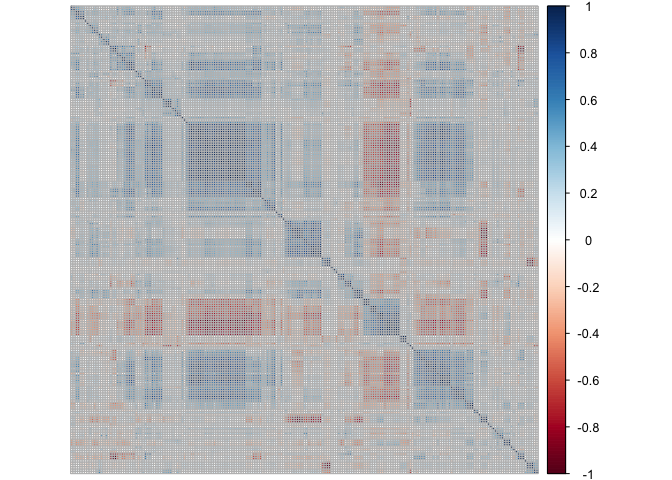
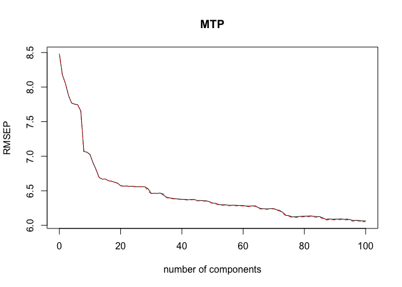
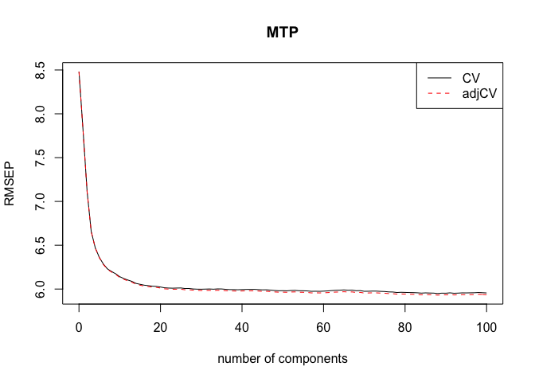
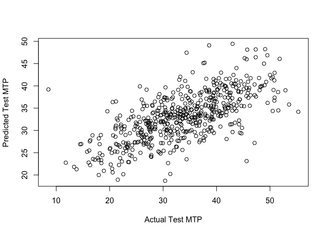
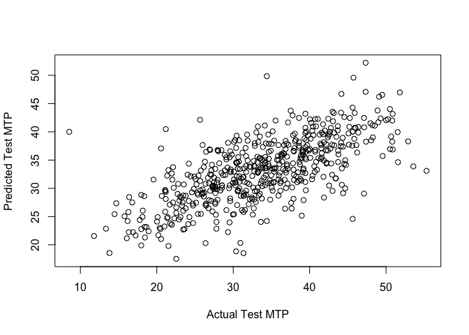

Crystal Melting Point Data
==========================

In their 2005 paper “General Boiling Point Prediction Based on a Diverse
Compound Data Set and Artificial Neural Networks”, Karthikeyan, Glen,
and Bender examine methods for the prediction of melting points using a
number of 2D and 3D descriptors that capture molecular physicochemical
and other graph-based properties. The melting point is a fundamental
physicochemical property of a molecule that is controlled by both
single-molecule properties and intermolecular interactions due to
packing in the solid state. Thus, it is difficult to predict, and
previously only melting point models for clearly defined and smaller
compound sets have been developed. The data frame QSAR.melt contains
data for 4401 compounds that can be used to develop a model for melting
point. There data are contained in the file QSAR Melting Points
(subset).csv on the course website.

Goal: Use PCR and PLS develop models and compare their ability to
predict melting point.

- [Data Preperation](#Data-Preperation)
- [PCR Model](#PCR-Model)
- [PLS Model](#PLS-Model)
- [PCR and PLS](#PCR-and-PLS)
- [Monte Carlo and Results](#Monte-Carlo-and-Results)


Packages: tidyr, dplyr, ggplot2, e1071, nnet, car, ISLR, MASS, glmnet, pls, corrplot, caret.

Data Preperation
================

``` r
QSAR.melt = read.csv("Melting Point QSAR.csv")

#preprocess this data for 203 predictors
QSAR.bc = preProcess(QSAR.melt, method = "BoxCox")
QSAR.melt = predict(QSAR.bc, QSAR.melt)

set.seed(1)
QSAR.melt = QSAR.melt[,-1] # remove Case column which is an ID
train = sample(nrow(QSAR.melt),3900)
test = -(train)
X = QSAR.melt[,-1]   # grab all the predictors, Y = MTP is the 1st column
Xs = scale(X)        # scale the predictors
QSAR = data.frame(MTP=QSAR.melt$MTP,Xs)
qsar.train = QSAR[train,]
qsar.test = QSAR[test,]
```

PCR Model
=========

We are going to develop an “optimal” PCR model.

Now we will look at a corrplot as well and generate a correlation
matrix.

``` r
QSAR.cor = cor(x =QSAR.melt, use = "na.or.complete") #deal with missing values

corrplot(QSAR.cor, order = 'hclust', hclust.method = 'complete', tl.pos = 'n' )
```



``` r
detach(package:corrplot)
```

While the NA values do dampen the overall effectiveness, we still are
able to seem some correlation bewteen the various variables, we should
bode well for our model in terms of variable reduction. Obviously due to
our missing values we get uncalculatable correlations, shown as gray in
the plot above. We will now fit a pcr model with a bunch of components
and use a validation plot to attempt to narrow the number of components
used down to a more reasonable number. We will use 40 to start as
instructed by the code provided.

``` r
qsar.pcr = pcr(MTP~.,ncomp=40,validation="CV", scale = T, data=qsar.train)

summary(qsar.pcr)
```

    ## Data:    X dimension: 3859 202 
    ##  Y dimension: 3859 1
    ## Fit method: svdpc
    ## Number of components considered: 40
    ## 
    ## VALIDATION: RMSEP
    ## Cross-validated using 10 random segments.
    ##        (Intercept)  1 comps  2 comps  3 comps  4 comps  5 comps  6 comps
    ## CV           8.482    8.177    8.054    7.883    7.777    7.750    7.742
    ## adjCV        8.482    8.177    8.053    7.882    7.775    7.749    7.741
    ##        7 comps  8 comps  9 comps  10 comps  11 comps  12 comps  13 comps
    ## CV       7.654    7.072    7.055     7.028     6.923     6.811     6.696
    ## adjCV    7.653    7.069    7.053     7.027     6.921     6.802     6.693
    ##        14 comps  15 comps  16 comps  17 comps  18 comps  19 comps
    ## CV        6.674     6.683     6.656     6.656     6.638     6.622
    ## adjCV     6.672     6.681     6.653     6.657     6.635     6.620
    ##        20 comps  21 comps  22 comps  23 comps  24 comps  25 comps
    ## CV        6.582     6.577     6.577     6.563     6.563     6.565
    ## adjCV     6.578     6.573     6.574     6.558     6.560     6.561
    ##        26 comps  27 comps  28 comps  29 comps  30 comps  31 comps
    ## CV        6.572     6.568     6.564     6.535     6.471     6.472
    ## adjCV     6.568     6.565     6.562     6.497     6.464     6.467
    ##        32 comps  33 comps  34 comps  35 comps  36 comps  37 comps
    ## CV        6.476     6.475     6.450     6.417     6.408     6.401
    ## adjCV     6.472     6.472     6.469     6.410     6.403     6.397
    ##        38 comps  39 comps  40 comps
    ## CV        6.388     6.382     6.375
    ## adjCV     6.383     6.377     6.370
    ## 
    ## TRAINING: % variance explained
    ##      1 comps  2 comps  3 comps  4 comps  5 comps  6 comps  7 comps
    ## X     33.255    46.49    54.01    58.56    62.52    66.18    69.10
    ## MTP    7.143    10.01    13.87    16.25    16.82    17.12    19.03
    ##      8 comps  9 comps  10 comps  11 comps  12 comps  13 comps  14 comps
    ## X      71.42    73.44     75.13     76.67     78.03     79.36     80.57
    ## MTP    30.91    31.26     31.91     34.13     36.16     38.22     38.69
    ##      15 comps  16 comps  17 comps  18 comps  19 comps  20 comps  21 comps
    ## X       81.60     82.54     83.42     84.28     85.05     85.75     86.42
    ## MTP     38.69     39.26     39.27     39.67     39.92     40.70     40.90
    ##      22 comps  23 comps  24 comps  25 comps  26 comps  27 comps  28 comps
    ## X       87.06     87.65     88.23     88.79     89.32     89.83     90.33
    ## MTP     40.91     41.14     41.16     41.31     41.31     41.37     41.39
    ##      29 comps  30 comps  31 comps  32 comps  33 comps  34 comps  35 comps
    ## X       90.79     91.25     91.69     92.10     92.51     92.89     93.27
    ## MTP     42.83     43.13     43.14     43.15     43.15     43.15     44.34
    ##      36 comps  37 comps  38 comps  39 comps  40 comps
    ## X       93.64     93.99     94.33     94.65     94.95
    ## MTP     44.45     44.57     44.80     44.91     45.07

Looking at CVs, we see that about 40 components appears to be optimal.
Although for variability explained in the melting point, that value
first reaches 90 at about 28 components. This is promising, but to be
throughout we wanted to look at a wider scale. This lead us to wideing
our search to up to 100 components just to see what might be found.

``` r
qsar.pcr = pcr(MTP~.,ncomp=100,validation="CV", scale = T, data=qsar.train)

summary(qsar.pcr)
```

    ## Data:    X dimension: 3859 202 
    ##  Y dimension: 3859 1
    ## Fit method: svdpc
    ## Number of components considered: 100
    ## 
    ## VALIDATION: RMSEP
    ## Cross-validated using 10 random segments.
    ##        (Intercept)  1 comps  2 comps  3 comps  4 comps  5 comps  6 comps
    ## CV           8.482    8.176    8.051    7.878    7.769    7.754    7.744
    ## adjCV        8.482    8.176    8.051    7.878    7.768    7.752    7.743
    ##        7 comps  8 comps  9 comps  10 comps  11 comps  12 comps  13 comps
    ## CV       7.654    7.068    7.058     7.026     6.906     6.806     6.692
    ## adjCV    7.653    7.066    7.056     7.024     6.904     6.801     6.690
    ##        14 comps  15 comps  16 comps  17 comps  18 comps  19 comps
    ## CV        6.669     6.671     6.646     6.639     6.625     6.610
    ## adjCV     6.667     6.669     6.643     6.639     6.623     6.608
    ##        20 comps  21 comps  22 comps  23 comps  24 comps  25 comps
    ## CV        6.575     6.567     6.570     6.563     6.566     6.559
    ## adjCV     6.572     6.564     6.568     6.560     6.564     6.556
    ##        26 comps  27 comps  28 comps  29 comps  30 comps  31 comps
    ## CV        6.560     6.559     6.557     6.526     6.462     6.464
    ## adjCV     6.557     6.556     6.555     6.491     6.458     6.461
    ##        32 comps  33 comps  34 comps  35 comps  36 comps  37 comps
    ## CV        6.463     6.467     6.437     6.407     6.397     6.390
    ## adjCV     6.460     6.465     6.455     6.398     6.392     6.384
    ##        38 comps  39 comps  40 comps  41 comps  42 comps  43 comps
    ## CV        6.384     6.380     6.376     6.376     6.371     6.374
    ## adjCV     6.379     6.376     6.371     6.371     6.363     6.368
    ##        44 comps  45 comps  46 comps  47 comps  48 comps  49 comps
    ## CV        6.375     6.359     6.360     6.355     6.355     6.342
    ## adjCV     6.372     6.353     6.355     6.349     6.349     6.338
    ##        50 comps  51 comps  52 comps  53 comps  54 comps  55 comps
    ## CV        6.322     6.318     6.302     6.297     6.298     6.292
    ## adjCV     6.314     6.312     6.294     6.291     6.292     6.285
    ##        56 comps  57 comps  58 comps  59 comps  60 comps  61 comps
    ## CV        6.290     6.292     6.289     6.286     6.286     6.279
    ## adjCV     6.283     6.286     6.281     6.279     6.281     6.271
    ##        62 comps  63 comps  64 comps  65 comps  66 comps  67 comps
    ## CV        6.278     6.281     6.282     6.254     6.242     6.240
    ## adjCV     6.270     6.274     6.276     6.246     6.234     6.231
    ##        68 comps  69 comps  70 comps  71 comps  72 comps  73 comps
    ## CV        6.239     6.242     6.242     6.224     6.214     6.185
    ## adjCV     6.231     6.235     6.238     6.215     6.206     6.175
    ##        74 comps  75 comps  76 comps  77 comps  78 comps  79 comps
    ## CV        6.145     6.139     6.123     6.123     6.127     6.130
    ## adjCV     6.135     6.129     6.113     6.114     6.117     6.121
    ##        80 comps  81 comps  82 comps  83 comps  84 comps  85 comps
    ## CV        6.132     6.134     6.137     6.130     6.126     6.126
    ## adjCV     6.122     6.124     6.127     6.121     6.116     6.116
    ##        86 comps  87 comps  88 comps  89 comps  90 comps  91 comps
    ## CV        6.107     6.087     6.093     6.088     6.090     6.091
    ## adjCV     6.097     6.074     6.082     6.077     6.079     6.080
    ##        92 comps  93 comps  94 comps  95 comps  96 comps  97 comps
    ## CV        6.094     6.086     6.091     6.080     6.071     6.074
    ## adjCV     6.083     6.075     6.080     6.069     6.057     6.062
    ##        98 comps  99 comps  100 comps
    ## CV        6.069     6.064      6.064
    ## adjCV     6.060     6.052      6.053
    ## 
    ## TRAINING: % variance explained
    ##      1 comps  2 comps  3 comps  4 comps  5 comps  6 comps  7 comps
    ## X     33.255    46.49    54.01    58.56    62.52    66.18    69.10
    ## MTP    7.143    10.01    13.87    16.25    16.82    17.12    19.03
    ##      8 comps  9 comps  10 comps  11 comps  12 comps  13 comps  14 comps
    ## X      71.42    73.44     75.13     76.67     78.03     79.36     80.57
    ## MTP    30.91    31.26     31.91     34.13     36.16     38.22     38.69
    ##      15 comps  16 comps  17 comps  18 comps  19 comps  20 comps  21 comps
    ## X       81.60     82.54     83.42     84.28     85.05     85.75     86.42
    ## MTP     38.69     39.26     39.27     39.67     39.92     40.70     40.90
    ##      22 comps  23 comps  24 comps  25 comps  26 comps  27 comps  28 comps
    ## X       87.06     87.65     88.23     88.79     89.32     89.83     90.33
    ## MTP     40.91     41.14     41.16     41.31     41.31     41.37     41.39
    ##      29 comps  30 comps  31 comps  32 comps  33 comps  34 comps  35 comps
    ## X       90.79     91.25     91.69     92.10     92.51     92.89     93.27
    ## MTP     42.83     43.13     43.14     43.15     43.15     43.15     44.34
    ##      36 comps  37 comps  38 comps  39 comps  40 comps  41 comps  42 comps
    ## X       93.64     93.99     94.33     94.65     94.95     95.24     95.51
    ## MTP     44.45     44.57     44.80     44.91     45.07     45.07     45.28
    ##      43 comps  44 comps  45 comps  46 comps  47 comps  48 comps  49 comps
    ## X       95.78     96.03     96.27     96.50     96.72     96.90     97.08
    ## MTP     45.28     45.30     45.56     45.56     45.65     45.68     45.88
    ##      50 comps  51 comps  52 comps  53 comps  54 comps  55 comps  56 comps
    ## X       97.26     97.42     97.58     97.73     97.87     98.00     98.12
    ## MTP     46.36     46.37     46.75     46.82     46.92     47.07     47.16
    ##      57 comps  58 comps  59 comps  60 comps  61 comps  62 comps  63 comps
    ## X       98.23     98.33     98.43     98.53     98.62     98.70     98.77
    ## MTP     47.17     47.32     47.38     47.43     47.59     47.64     47.65
    ##      64 comps  65 comps  66 comps  67 comps  68 comps  69 comps  70 comps
    ## X       98.85     98.92     98.98     99.04     99.09     99.14     99.19
    ## MTP     47.66     48.17     48.40     48.51     48.54     48.55     48.55
    ##      71 comps  72 comps  73 comps  74 comps  75 comps  76 comps  77 comps
    ## X       99.24     99.29     99.33     99.37     99.40     99.44     99.47
    ## MTP     48.88     49.11     49.66     50.30     50.42     50.67     50.69
    ##      78 comps  79 comps  80 comps  81 comps  82 comps  83 comps  84 comps
    ## X       99.51     99.54     99.56     99.59     99.62     99.64     99.66
    ## MTP     50.69     50.69     50.70     50.70     50.70     50.82     50.97
    ##      85 comps  86 comps  87 comps  88 comps  89 comps  90 comps  91 comps
    ## X       99.68     99.70     99.72     99.73     99.75     99.77     99.78
    ## MTP     50.98     51.21     51.58     51.62     51.70     51.71     51.75
    ##      92 comps  93 comps  94 comps  95 comps  96 comps  97 comps  98 comps
    ## X       99.79     99.81     99.82     99.83     99.84     99.85     99.86
    ## MTP     51.76     51.87     51.89     52.05     52.25     52.25     52.31
    ##      99 comps  100 comps
    ## X       99.87      99.87
    ## MTP     52.48      52.49

Based on CV values here, we get ever increasing components used, upwards
towards our limit, but the returns are ever diminishing. However, in
terms of meaningful increases in variation exaplined, nothing past 67
components has a discernable impact, and anything 41 or above is greater
then 95%, giving us a decent range of values to investigate further.

To get a better sense of these patterns overall, we also looked at a
validation plot.

``` r
validationplot(qsar.pcr, val.type = "RMSEP")
```



This plot lines up with our stated results quite nicely, with the late
60s being the last values to truly make a difference while a vast
majority of the work is done by roughly 40 of them. Now that we have our
candiate values, we can further use cross-validation on the test set to
pick the best one.

``` r
yact = qsar.test$MTP

ypred = predict(qsar.pcr, ncomp = 41, newdata = qsar.test)
paste("RMSEP:", sqrt(mean((ypred-yact)^2, na.rm = TRUE)))
```

    ## [1] "RMSEP: 6.55985046894924"

``` r
#"RMSEP: 6.55985046894924"

ypred = predict(qsar.pcr, ncomp = 42, newdata = qsar.test)
paste("RMSEP:", sqrt(mean((ypred-yact)^2, na.rm = TRUE)))
```

    ## [1] "RMSEP: 6.53711890597628"

``` r
#"RMSEP: 6.53711890597628"

ypred = predict(qsar.pcr, ncomp = 43, newdata = qsar.test)
paste("RMSEP:", sqrt(mean((ypred-yact)^2, na.rm = TRUE)))
```

    ## [1] "RMSEP: 6.53827397067486"

``` r
#"RMSEP: 6.53827397067486"

ypred = predict(qsar.pcr, ncomp = 44, newdata = qsar.test)
paste("RMSEP:", sqrt(mean((ypred-yact)^2, na.rm = TRUE)))
```

    ## [1] "RMSEP: 6.5303035536344"

``` r
#"RMSEP: 6.5303035536344"

ypred = predict(qsar.pcr, ncomp = 45, newdata = qsar.test)
paste("RMSEP:", sqrt(mean((ypred-yact)^2, na.rm = TRUE)))
```

    ## [1] "RMSEP: 6.48699166773672"

``` r
#"RMSEP: 6.48699166773672"

ypred = predict(qsar.pcr, ncomp = 46, newdata = qsar.test)
paste("RMSEP:", sqrt(mean((ypred-yact)^2, na.rm = TRUE)))
```

    ## [1] "RMSEP: 6.48611097491785"

``` r
#"RMSEP: 6.48611097491785"

ypred = predict(qsar.pcr, ncomp = 47, newdata = qsar.test)
paste("RMSEP:", sqrt(mean((ypred-yact)^2, na.rm = TRUE)))
```

    ## [1] "RMSEP: 6.46567990229641"

``` r
#"RMSEP: 6.46567990229641"

ypred = predict(qsar.pcr, ncomp = 48, newdata = qsar.test)
paste("RMSEP:", sqrt(mean((ypred-yact)^2, na.rm = TRUE)))
```

    ## [1] "RMSEP: 6.47194211820051"

``` r
#"RMSEP: 6.47194211820051"

ypred = predict(qsar.pcr, ncomp = 49, newdata = qsar.test)
paste("RMSEP:", sqrt(mean((ypred-yact)^2, na.rm = TRUE)))
```

    ## [1] "RMSEP: 6.46930828577019"

``` r
#"RMSEP: 6.46930828577019"

ypred = predict(qsar.pcr, ncomp = 50, newdata = qsar.test)
paste("RMSEP:", sqrt(mean((ypred-yact)^2, na.rm = TRUE)))
```

    ## [1] "RMSEP: 6.43156297639954"

``` r
#"RMSEP: 6.43156297639954"


ypred = predict(qsar.pcr, ncomp = 51, newdata = qsar.test)
paste("RMSEP:", sqrt(mean((ypred-yact)^2, na.rm = TRUE)))
```

    ## [1] "RMSEP: 6.43135633338793"

``` r
#"RMSEP: 6.43135633338793"

ypred = predict(qsar.pcr, ncomp = 52, newdata = qsar.test)
paste("RMSEP:", sqrt(mean((ypred-yact)^2, na.rm = TRUE)))
```

    ## [1] "RMSEP: 6.42057808785403"

``` r
#"RMSEP: 6.42057808785403"


ypred = predict(qsar.pcr, ncomp = 53, newdata = qsar.test)
paste("RMSEP:", sqrt(mean((ypred-yact)^2, na.rm = TRUE)))
```

    ## [1] "RMSEP: 6.39756284309691"

``` r
#"RMSEP: 6.39756284309691"

ypred = predict(qsar.pcr, ncomp = 54, newdata = qsar.test)
paste("RMSEP:", sqrt(mean((ypred-yact)^2, na.rm = TRUE)))
```

    ## [1] "RMSEP: 6.38667367545325"

``` r
#"RMSEP: 6.38667367545324"

ypred = predict(qsar.pcr, ncomp = 55, newdata = qsar.test)
paste("RMSEP:", sqrt(mean((ypred-yact)^2, na.rm = TRUE)))
```

    ## [1] "RMSEP: 6.36172667707252"

``` r
#"RMSEP: 6.36172667707251"

ypred = predict(qsar.pcr, ncomp = 56, newdata = qsar.test)
paste("RMSEP:", sqrt(mean((ypred-yact)^2, na.rm = TRUE)))
```

    ## [1] "RMSEP: 6.37699193673916"

``` r
#"RMSEP: 6.37699193673916"

ypred = predict(qsar.pcr, ncomp = 57, newdata = qsar.test)
paste("RMSEP:", sqrt(mean((ypred-yact)^2, na.rm = TRUE)))
```

    ## [1] "RMSEP: 6.37368832848207"

``` r
#"RMSEP: 6.37368832848207"

ypred = predict(qsar.pcr, ncomp = 58, newdata = qsar.test)
paste("RMSEP:", sqrt(mean((ypred-yact)^2, na.rm = TRUE)))
```

    ## [1] "RMSEP: 6.36394359175292"

``` r
#"RMSEP: 6.36394359175292"

ypred = predict(qsar.pcr, ncomp = 59, newdata = qsar.test)
paste("RMSEP:", sqrt(mean((ypred-yact)^2, na.rm = TRUE)))
```

    ## [1] "RMSEP: 6.35095658191415"

``` r
#"RMSEP: 6.35095658191415"

ypred = predict(qsar.pcr, ncomp = 60, newdata = qsar.test)
paste("RMSEP:", sqrt(mean((ypred-yact)^2, na.rm = TRUE)))
```

    ## [1] "RMSEP: 6.34722595702933"

``` r
#"RMSEP: 6.34722595702933"

ypred = predict(qsar.pcr, ncomp = 61, newdata = qsar.test)
paste("RMSEP:", sqrt(mean((ypred-yact)^2, na.rm = TRUE)))
```

    ## [1] "RMSEP: 6.35327096257996"

``` r
#"RMSEP: 6.35327096257996"

ypred = predict(qsar.pcr, ncomp = 62, newdata = qsar.test)
paste("RMSEP:", sqrt(mean((ypred-yact)^2, na.rm = TRUE)))
```

    ## [1] "RMSEP: 6.33764621264906"

``` r
#"RMSEP: 6.33764621264906"

ypred = predict(qsar.pcr, ncomp = 63, newdata = qsar.test)
paste("RMSEP:", sqrt(mean((ypred-yact)^2, na.rm = TRUE)))
```

    ## [1] "RMSEP: 6.33320007487676"

``` r
#"RMSEP: 6.33320007487676"

ypred = predict(qsar.pcr, ncomp = 64, newdata = qsar.test)
paste("RMSEP:", sqrt(mean((ypred-yact)^2, na.rm = TRUE)))
```

    ## [1] "RMSEP: 6.32901647673303"

``` r
#"RMSEP: 6.32901647673303"

ypred = predict(qsar.pcr, ncomp = 65, newdata = qsar.test)
paste("RMSEP:", sqrt(mean((ypred-yact)^2, na.rm = TRUE)))
```

    ## [1] "RMSEP: 6.30334531059487"

``` r
#"RMSEP: 6.30334531059486"

ypred = predict(qsar.pcr, ncomp = 66, newdata = qsar.test)
paste("RMSEP:", sqrt(mean((ypred-yact)^2, na.rm = TRUE)))
```

    ## [1] "RMSEP: 6.28778011423847"

``` r
#"RMSEP: 6.28778011423847"

ypred = predict(qsar.pcr, ncomp = 67, newdata = qsar.test)
paste("RMSEP:", sqrt(mean((ypred-yact)^2, na.rm = TRUE)))
```

    ## [1] "RMSEP: 6.28117819589368"

``` r
#"RMSEP: 6.28117819589367"

ypred = predict(qsar.pcr, ncomp = 68, newdata = qsar.test)
paste("RMSEP:", sqrt(mean((ypred-yact)^2, na.rm = TRUE)))
```

    ## [1] "RMSEP: 6.28287674977966"

``` r
#"RMSEP: 6.28287674977966"

ypred = predict(qsar.pcr, ncomp = 69, newdata = qsar.test)
paste("RMSEP:", sqrt(mean((ypred-yact)^2, na.rm = TRUE)))
```

    ## [1] "RMSEP: 6.28639638441397"

``` r
#"RMSEP: 6.28639638441397"

ypred = predict(qsar.pcr, ncomp = 70, newdata = qsar.test)
paste("RMSEP:", sqrt(mean((ypred-yact)^2, na.rm = TRUE)))
```

    ## [1] "RMSEP: 6.28703099462511"

``` r
#"RMSEP: 6.28703099462511"

ypred = predict(qsar.pcr, ncomp = 71, newdata = qsar.test)
paste("RMSEP:", sqrt(mean((ypred-yact)^2, na.rm = TRUE)))
```

    ## [1] "RMSEP: 6.27315740303121"

``` r
#"RMSEP: 6.27315740303121"
```

Using RMSEP as our metric, we can see that the sweet spot appears to be
66 principle components. While that is a lot, compared to the 203
variables we started with that is roughly a 67% reduction in the number
or predictors while also dealing with any collineation that was present.
Our optimal PCR model uses 66 components.

PLS Model
=========

We are going to develop an “optimal” PLS model.

``` r
qsar.pls = plsr(MTP~.,ncomp=40,validation="CV", scale = TRUE, data=qsar.train)
summary(qsar.pls)
```

    ## Data:    X dimension: 3859 202 
    ##  Y dimension: 3859 1
    ## Fit method: kernelpls
    ## Number of components considered: 40
    ## 
    ## VALIDATION: RMSEP
    ## Cross-validated using 10 random segments.
    ##        (Intercept)  1 comps  2 comps  3 comps  4 comps  5 comps  6 comps
    ## CV           8.482    7.813    7.113    6.660    6.471    6.361    6.281
    ## adjCV        8.482    7.813    7.111    6.658    6.469    6.358    6.276
    ##        7 comps  8 comps  9 comps  10 comps  11 comps  12 comps  13 comps
    ## CV       6.230    6.201    6.175     6.143     6.124     6.106      6.09
    ## adjCV    6.224    6.194    6.167     6.134     6.115     6.097      6.08
    ##        14 comps  15 comps  16 comps  17 comps  18 comps  19 comps
    ## CV        6.067     6.057     6.046      6.04     6.033     6.029
    ## adjCV     6.058     6.046     6.036      6.03     6.023     6.018
    ##        20 comps  21 comps  22 comps  23 comps  24 comps  25 comps
    ## CV        6.022     6.017     6.013     6.013     6.017     6.022
    ## adjCV     6.011     6.006     6.002     6.001     6.004     6.008
    ##        26 comps  27 comps  28 comps  29 comps  30 comps  31 comps
    ## CV        6.017     6.017     6.014     6.015     6.011     6.014
    ## adjCV     6.003     6.002     5.999     6.000     5.996     5.998
    ##        32 comps  33 comps  34 comps  35 comps  36 comps  37 comps
    ## CV        6.015     6.016     6.015     6.018     6.019     6.012
    ## adjCV     5.998     6.000     5.999     6.001     6.002     5.996
    ##        38 comps  39 comps  40 comps
    ## CV        6.018     6.015     6.017
    ## adjCV     6.000     5.998     6.000
    ## 
    ## TRAINING: % variance explained
    ##      1 comps  2 comps  3 comps  4 comps  5 comps  6 comps  7 comps
    ## X      30.92    41.67    49.56    55.78    59.30    61.71    63.67
    ## MTP    15.37    30.26    39.15    42.74    44.95    46.80    48.08
    ##      8 comps  9 comps  10 comps  11 comps  12 comps  13 comps  14 comps
    ## X      66.20    68.33     70.08     72.00     74.32     75.60     76.64
    ## MTP    48.75    49.44     50.19     50.74     51.13     51.52     51.91
    ##      15 comps  16 comps  17 comps  18 comps  19 comps  20 comps  21 comps
    ## X        77.8     78.68     79.72     80.55     81.35     82.02     82.66
    ## MTP      52.2     52.43     52.59     52.77     52.95     53.16     53.32
    ##      22 comps  23 comps  24 comps  25 comps  26 comps  27 comps  28 comps
    ## X       83.40     84.18     84.69     85.11     85.62     86.09     86.76
    ## MTP     53.46     53.57     53.71     53.83     53.91     54.00     54.06
    ##      29 comps  30 comps  31 comps  32 comps  33 comps  34 comps  35 comps
    ## X       87.22     87.61     87.97     88.46     88.94     89.43     89.76
    ## MTP     54.15     54.25     54.34     54.39     54.44     54.48     54.52
    ##      36 comps  37 comps  38 comps  39 comps  40 comps
    ## X       90.08     90.39     90.66     91.06     91.39
    ## MTP     54.57     54.63     54.69     54.72     54.76

Looking at CVs, it seems that by the time we get to 30 components we
begin to chase our tails as far as improvements go. This lines up with
what we see with percent of variation explained, as we stop seeing any
dramatic impacts past around 27 components. Much like with pcr, for the
sake of being thorough, we also looked at 100 components, although with
pcl especially it is doubtful that anything of greater impact will be
found.

``` r
qsar.pls = plsr(MTP~.,ncomp=100,validation="CV", scale = TRUE, data=qsar.train)
summary(qsar.pls)
```

    ## Data:    X dimension: 3859 202 
    ##  Y dimension: 3859 1
    ## Fit method: kernelpls
    ## Number of components considered: 100
    ## 
    ## VALIDATION: RMSEP
    ## Cross-validated using 10 random segments.
    ##        (Intercept)  1 comps  2 comps  3 comps  4 comps  5 comps  6 comps
    ## CV           8.482    7.810    7.110    6.658    6.470    6.360    6.284
    ## adjCV        8.482    7.809    7.109    6.656    6.468    6.358    6.279
    ##        7 comps  8 comps  9 comps  10 comps  11 comps  12 comps  13 comps
    ## CV       6.229    6.200    6.174     6.141     6.120     6.103     6.087
    ## adjCV    6.223    6.194    6.167     6.133     6.111     6.093     6.077
    ##        14 comps  15 comps  16 comps  17 comps  18 comps  19 comps
    ## CV        6.064     6.054     6.044     6.039     6.033     6.030
    ## adjCV     6.055     6.044     6.034     6.028     6.022     6.019
    ##        20 comps  21 comps  22 comps  23 comps  24 comps  25 comps
    ## CV        6.023     6.014     6.011     6.010     6.011     6.012
    ## adjCV     6.011     6.003     6.000     5.998     5.998     5.998
    ##        26 comps  27 comps  28 comps  29 comps  30 comps  31 comps
    ## CV        6.006     6.006     6.001     5.999     5.998     5.999
    ## adjCV     5.992     5.992     5.987     5.985     5.984     5.984
    ##        32 comps  33 comps  34 comps  35 comps  36 comps  37 comps
    ## CV        6.001     5.998     6.002     6.001     5.997     5.994
    ## adjCV     5.985     5.983     5.986     5.985     5.981     5.978
    ##        38 comps  39 comps  40 comps  41 comps  42 comps  43 comps
    ## CV        5.994     5.992     5.994     5.996     5.996     5.996
    ## adjCV     5.978     5.976     5.978     5.979     5.980     5.980
    ##        44 comps  45 comps  46 comps  47 comps  48 comps  49 comps
    ## CV        5.994     5.991     5.992     5.987     5.984     5.981
    ## adjCV     5.977     5.974     5.975     5.971     5.967     5.964
    ##        50 comps  51 comps  52 comps  53 comps  54 comps  55 comps
    ## CV        5.981     5.980     5.984     5.985     5.981     5.980
    ## adjCV     5.965     5.963     5.966     5.967     5.964     5.963
    ##        56 comps  57 comps  58 comps  59 comps  60 comps  61 comps
    ## CV        5.979     5.974     5.975     5.974     5.976     5.979
    ## adjCV     5.961     5.956     5.957     5.956     5.957     5.959
    ##        62 comps  63 comps  64 comps  65 comps  66 comps  67 comps
    ## CV        5.983     5.986     5.987     5.990     5.986     5.987
    ## adjCV     5.963     5.965     5.967     5.969     5.966     5.967
    ##        68 comps  69 comps  70 comps  71 comps  72 comps  73 comps
    ## CV        5.981     5.982     5.974     5.975     5.977     5.976
    ## adjCV     5.961     5.962     5.955     5.955     5.957     5.957
    ##        74 comps  75 comps  76 comps  77 comps  78 comps  79 comps
    ## CV        5.973     5.972     5.967     5.966     5.961     5.963
    ## adjCV     5.954     5.952     5.948     5.947     5.942     5.944
    ##        80 comps  81 comps  82 comps  83 comps  84 comps  85 comps
    ## CV        5.962     5.960     5.959     5.957     5.954     5.956
    ## adjCV     5.943     5.941     5.940     5.938     5.935     5.937
    ##        86 comps  87 comps  88 comps  89 comps  90 comps  91 comps
    ## CV        5.955     5.954     5.949     5.953     5.953     5.957
    ## adjCV     5.936     5.935     5.931     5.934     5.934     5.937
    ##        92 comps  93 comps  94 comps  95 comps  96 comps  97 comps
    ## CV        5.952     5.954     5.956     5.956     5.957     5.958
    ## adjCV     5.933     5.934     5.936     5.936     5.936     5.937
    ##        98 comps  99 comps  100 comps
    ## CV        5.961     5.958      5.956
    ## adjCV     5.940     5.938      5.935
    ## 
    ## TRAINING: % variance explained
    ##      1 comps  2 comps  3 comps  4 comps  5 comps  6 comps  7 comps
    ## X      30.92    41.67    49.56    55.78    59.30    61.71    63.67
    ## MTP    15.37    30.26    39.15    42.74    44.95    46.80    48.08
    ##      8 comps  9 comps  10 comps  11 comps  12 comps  13 comps  14 comps
    ## X      66.20    68.33     70.08     72.00     74.32     75.60     76.64
    ## MTP    48.75    49.44     50.19     50.74     51.13     51.52     51.91
    ##      15 comps  16 comps  17 comps  18 comps  19 comps  20 comps  21 comps
    ## X        77.8     78.68     79.72     80.55     81.35     82.02     82.66
    ## MTP      52.2     52.43     52.59     52.77     52.95     53.16     53.32
    ##      22 comps  23 comps  24 comps  25 comps  26 comps  27 comps  28 comps
    ## X       83.40     84.18     84.69     85.11     85.62     86.09     86.76
    ## MTP     53.46     53.57     53.71     53.83     53.91     54.00     54.06
    ##      29 comps  30 comps  31 comps  32 comps  33 comps  34 comps  35 comps
    ## X       87.22     87.61     87.97     88.46     88.94     89.43     89.76
    ## MTP     54.15     54.25     54.34     54.39     54.44     54.48     54.52
    ##      36 comps  37 comps  38 comps  39 comps  40 comps  41 comps  42 comps
    ## X       90.08     90.39     90.66     91.06     91.39     91.66     91.93
    ## MTP     54.57     54.63     54.69     54.72     54.76     54.80     54.83
    ##      43 comps  44 comps  45 comps  46 comps  47 comps  48 comps  49 comps
    ## X       92.26     92.59     92.83     93.17     93.41     93.70     93.99
    ## MTP     54.86     54.90     54.95     54.99     55.04     55.07     55.10
    ##      50 comps  51 comps  52 comps  53 comps  54 comps  55 comps  56 comps
    ## X       94.24     94.52     94.75     95.02     95.23     95.51     95.72
    ## MTP     55.15     55.18     55.22     55.25     55.29     55.32     55.36
    ##      57 comps  58 comps  59 comps  60 comps  61 comps  62 comps  63 comps
    ## X       95.88     96.09     96.29     96.44     96.64     96.90     97.06
    ## MTP     55.42     55.46     55.49     55.53     55.56     55.59     55.63
    ##      64 comps  65 comps  66 comps  67 comps  68 comps  69 comps  70 comps
    ## X       97.24     97.43     97.68     97.86     97.98     98.14     98.27
    ## MTP     55.67     55.69     55.71     55.73     55.76     55.79     55.82
    ##      71 comps  72 comps  73 comps  74 comps  75 comps  76 comps  77 comps
    ## X       98.44     98.56     98.65     98.72     98.81     98.92     98.97
    ## MTP     55.83     55.85     55.88     55.90     55.92     55.93     55.96
    ##      78 comps  79 comps  80 comps  81 comps  82 comps  83 comps  84 comps
    ## X       99.03     99.08     99.14     99.20     99.25     99.29     99.32
    ## MTP     55.99     56.03     56.06     56.09     56.12     56.15     56.18
    ##      85 comps  86 comps  87 comps  88 comps  89 comps  90 comps  91 comps
    ## X       99.37     99.41     99.44     99.47     99.50     99.53     99.55
    ## MTP     56.20     56.22     56.24     56.26     56.28     56.30     56.32
    ##      92 comps  93 comps  94 comps  95 comps  96 comps  97 comps  98 comps
    ## X       99.57     99.59     99.61     99.63     99.65     99.69     99.70
    ## MTP     56.35     56.36     56.38     56.40     56.42     56.43     56.44
    ##      99 comps  100 comps
    ## X       99.72      99.73
    ## MTP     56.46      56.48

The only added conclusion we can make now is that it would take about 53
components to explain 95% of the variation. However, the amount of small
increments needed to get there could make one hesitant to use that many
components.

Looking at a plot of some internalally generated RMSEPs can help us make
a decision as well.

``` r
plot(RMSEP(qsar.pls), legendpos = "topright")
```



Looking at this plot, we can affirm our understanding based off of the
raw numbers, as we begin to start getting diminshing returns around the
late 20 values, with anything past it not really gaining anything
substantial. From here, we can now to some simple cross-validation on a
test set to narrow done to an optimal value.

``` r
ypred = predict(qsar.pls,ncomp=15,newdata=qsar.test)
yact = qsar.test$MTP
paste("RMSEP:", sqrt(mean((ypred-yact)^2, na.rm = TRUE)))
```

    ## [1] "RMSEP: 6.23322236871757"

``` r
#"RMSEP: 6.23322236871757"

ypred = predict(qsar.pls,ncomp=16,newdata=qsar.test)
yact = qsar.test$MTP
paste("RMSEP:", sqrt(mean((ypred-yact)^2, na.rm = TRUE)))
```

    ## [1] "RMSEP: 6.21110396320829"

``` r
#"RMSEP: 6.21110396320829"

ypred = predict(qsar.pls,ncomp=17,newdata=qsar.test)
yact = qsar.test$MTP
paste("RMSEP:", sqrt(mean((ypred-yact)^2, na.rm = TRUE)))
```

    ## [1] "RMSEP: 6.18492232023154"

``` r
#"RMSEP: 6.18492232023154"

ypred = predict(qsar.pls,ncomp=18,newdata=qsar.test)
yact = qsar.test$MTP
paste("RMSEP:", sqrt(mean((ypred-yact)^2, na.rm = TRUE)))
```

    ## [1] "RMSEP: 6.17286816385355"

``` r
#"RMSEP: 6.17286816385355"

ypred = predict(qsar.pls,ncomp=19,newdata=qsar.test)
yact = qsar.test$MTP
paste("RMSEP:", sqrt(mean((ypred-yact)^2, na.rm = TRUE)))
```

    ## [1] "RMSEP: 6.13469610335237"

``` r
#"RMSEP: 6.13469610335237"

ypred = predict(qsar.pls,ncomp=20,newdata=qsar.test)
yact = qsar.test$MTP
paste("RMSEP:", sqrt(mean((ypred-yact)^2, na.rm = TRUE)))
```

    ## [1] "RMSEP: 6.12842673233427"

``` r
#"RMSEP: 6.12842673233427"

ypred = predict(qsar.pls,ncomp=21,newdata=qsar.test)
yact = qsar.test$MTP
paste("RMSEP:", sqrt(mean((ypred-yact)^2, na.rm = TRUE)))
```

    ## [1] "RMSEP: 6.10055233123102"

``` r
#"RMSEP: 6.10055233123103"

ypred = predict(qsar.pls,ncomp=22,newdata=qsar.test)
yact = qsar.test$MTP
paste("RMSEP:", sqrt(mean((ypred-yact)^2, na.rm = TRUE)))
```

    ## [1] "RMSEP: 6.09748013448897"

``` r
#"RMSEP: 6.09748013448897"

ypred = predict(qsar.pls,ncomp=23,newdata=qsar.test)
yact = qsar.test$MTP
paste("RMSEP:", sqrt(mean((ypred-yact)^2, na.rm = TRUE)))
```

    ## [1] "RMSEP: 6.08947154781649"

``` r
#"RMSEP: 6.08947154781649"

ypred = predict(qsar.pls,ncomp=24,newdata=qsar.test)
yact = qsar.test$MTP
paste("RMSEP:", sqrt(mean((ypred-yact)^2, na.rm = TRUE)))
```

    ## [1] "RMSEP: 6.06296788926204"

``` r
#"RMSEP: 6.06296788926204"

ypred = predict(qsar.pls,ncomp=25,newdata=qsar.test)
yact = qsar.test$MTP
paste("RMSEP:", sqrt(mean((ypred-yact)^2, na.rm = TRUE)))
```

    ## [1] "RMSEP: 6.0223431390556"

``` r
#"RMSEP: 6.0223431390556"

ypred = predict(qsar.pls,ncomp=26,newdata=qsar.test)
yact = qsar.test$MTP
paste("RMSEP:", sqrt(mean((ypred-yact)^2, na.rm = TRUE)))
```

    ## [1] "RMSEP: 6.00714014366385"

``` r
#"RMSEP: 6.00714014366385"

ypred = predict(qsar.pls,ncomp=27,newdata=qsar.test)
yact = qsar.test$MTP
paste("RMSEP:", sqrt(mean((ypred-yact)^2, na.rm = TRUE)))
```

    ## [1] "RMSEP: 6.02572471482335"

``` r
#"RMSEP: 6.02572471482335"

ypred = predict(qsar.pls,ncomp=28,newdata=qsar.test)
yact = qsar.test$MTP
paste("RMSEP:", sqrt(mean((ypred-yact)^2, na.rm = TRUE)))
```

    ## [1] "RMSEP: 6.0278669763282"

``` r
#"RMSEP: 6.0278669763282"

ypred = predict(qsar.pls,ncomp=29,newdata=qsar.test)
yact = qsar.test$MTP
paste("RMSEP:", sqrt(mean((ypred-yact)^2, na.rm = TRUE)))
```

    ## [1] "RMSEP: 6.02910360178234"

``` r
# "RMSEP: 6.02910360178234"

ypred = predict(qsar.pls,ncomp=30,newdata=qsar.test)
yact = qsar.test$MTP
paste("RMSEP:", sqrt(mean((ypred-yact)^2, na.rm = TRUE)))
```

    ## [1] "RMSEP: 6.03459557696351"

``` r
#"RMSEP: 6.03459557696351"
```

While not immediatley clear from our plots or numeric measure, based on
actual cross-validaion our best metric was returned by a value an amount
of components as little as 16. This makes sense given PLS’s nature to
return less then pcr, but the ability to reduce the dimensionality by
nearly 92% is quite impressive. 16 components will be the basis for our
optimal model.

PCR and PLS
===========

Let’s us our “optimal” model for each method (PCR and PLS) to predict
the melting point of the test cases.

Which modeling method would perform the best when predicting the test
cases?

``` r
ypred = predict(qsar.pcr,ncomp=66,newdata=qsar.test)
ytest = qsar.test$MTP

Rsq.pred = 1 - (sum((ypred-ytest)^2, na.rm = TRUE)/sum((ytest - mean(ytest)^2), na.rm = TRUE))
Rsq.pred
```

    ## [1] 1.035464

``` r
#0.4539924

sum(predict(qsar.pcr, ncomp = 66, newdata = qsar.test) - qsar.test$MTP, na.rm = TRUE)^2
```

    ## [1] 75529.7

``` r
#75529.7
```

``` r
plot(ytest,ypred,xlab="Actual Test MTP",ylab="Predicted Test MTP")
```



``` r
ypred = predict(qsar.pls,ncomp=16,newdata=qsar.test)
ytest = qsar.test$MTP

Rsq.pred = 1 - (sum((ypred-ytest)^2, na.rm = TRUE)/sum((ytest - mean(ytest, na.rm = TRUE))^2))
Rsq.pred
```

    ## [1] 0.4672278

``` r
#0.4672278

sum(predict(qsar.pls,ncomp=16,newdata=qsar.test) - qsar.test$MTP, na.rm = TRUE)^2
```

    ## [1] 73332.51

``` r
#73332.51
```

``` r
plot(ytest,ypred,xlab="Actual Test MTP",ylab="Predicted Test MTP")
```



Based on the sums of sqaures of prediction error, we can see that the
PLS model performed slightly better, which makes sense given that it had
much more variable reduction as well as more heavily focusing on the
prediction of y then the organization of the x’compared to the pcr.
However, the RMSE was ever so slightly in favor of the pcr. While the
difference isn’t major, as shown by the plots, the pls is likely better
given its level of reduction. However there is likely still something to
be gained from looking at the relevant loadings of the pcr model, as it
may help organize the variables which could be useful for unsupervised
applications.

Monte Carlo and Results
=======================

Monte-carlo cross-validation functions accounting for missing values.

``` r
pls.cv = function(X,y,ncomp=2,p=.667,B=100) {
    n = length(y)
    X = scale(X)
data = data.frame(X,y)
cv <- rep(0,B)
for (i in 1:B) {
ss <- floor(n*p)
sam <- sample(1:n,ss,replace=F)
fit2 <- plsr(y~.,ncomp=ncomp,data=data[sam,])
ynew <- predict(fit2,ncomp=ncomp,newdata=data[-sam,])
cv[i] <- sqrt(mean((y[-sam]-ynew)^2,na.rm=T))
}
cv
}

pcr.cv = function(X,y,ncomp=2,p=.667,B=100) {
    n = length(y)
    X = scale(X)
data = data.frame(X,y)
cv <- rep(0,B)
for (i in 1:B) {
ss <- floor(n*p)
sam <- sample(1:n,ss,replace=F)
fit2 <- pcr(y~.,ncomp=ncomp,data=data[sam,])
ynew <- predict(fit2,ncomp=ncomp,newdata=data[-sam,])
cv[i] <- sqrt(mean((y[-sam]-ynew)^2,na.rm=T))
}
cv
}


mean(pcr.cv(X = X, y = QSAR.melt$MTP, ncomp = 66, p = 0.667, B = 100))
```

    ## [1] 6.24896

``` r
#6.255307

mean(pls.cv(X = X, y = QSAR.melt$MTP, ncomp = 16, p = 0.667, B = 100))
```

    ## [1] 6.082983

``` r
#6.077052
```

Echoing the results of our more rudimentary cross-validation in previous
problems, the PLS performs slightyl better over the long term with much
more reductive power. However, after 100 samplings, we now can now more
confidently state that the pls should perform better as a model on the
whole. Between their handling of collinearity and reduction of
variables, both methods though certainly earn their stripes and should
be kept in mind as an alternative to other methods to handle certain
problems.
