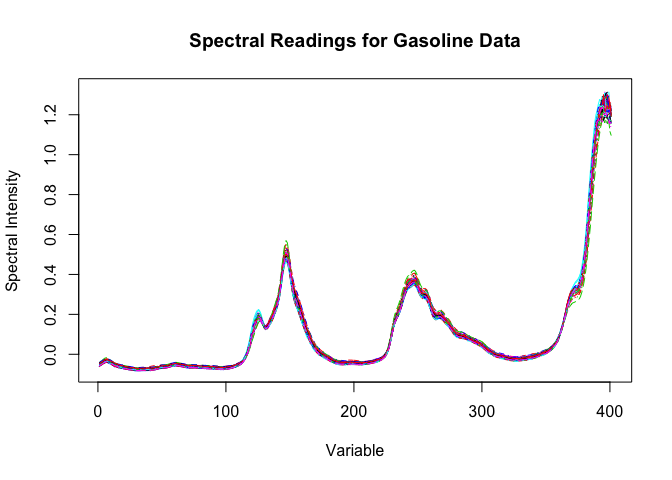
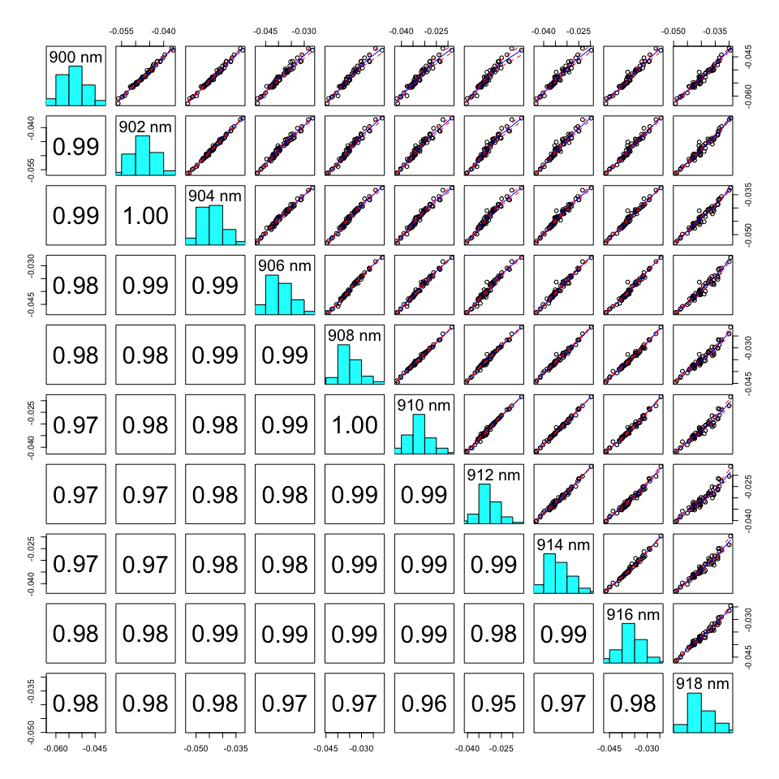
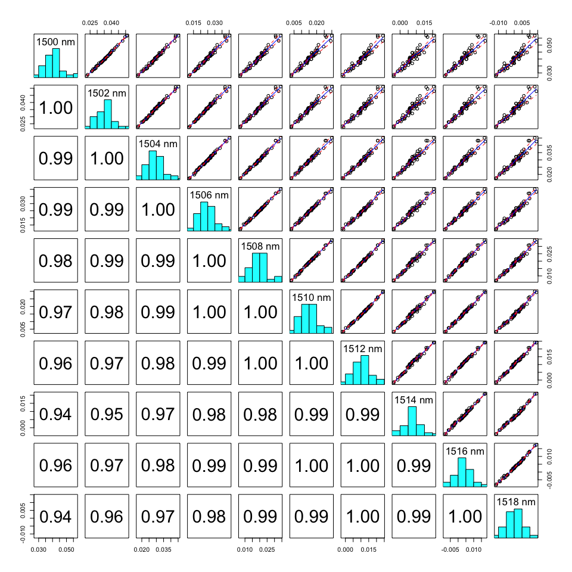
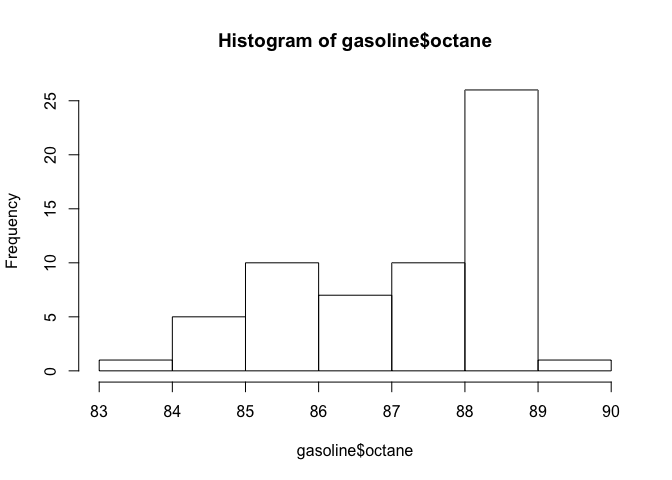
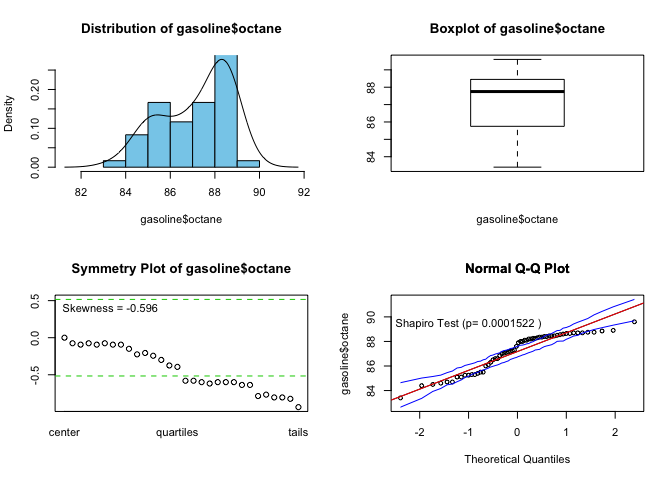
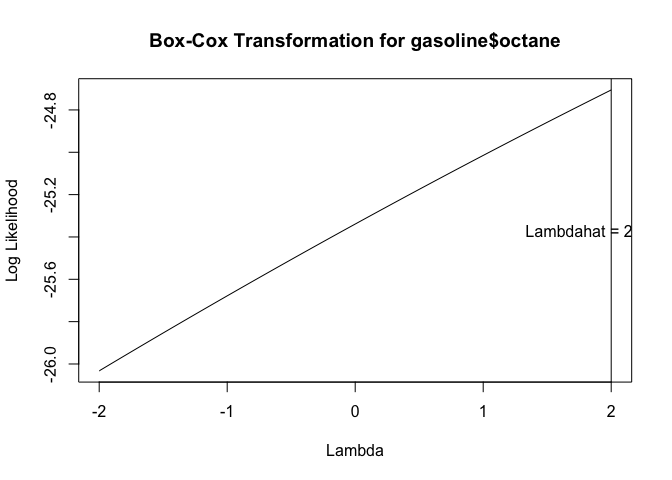
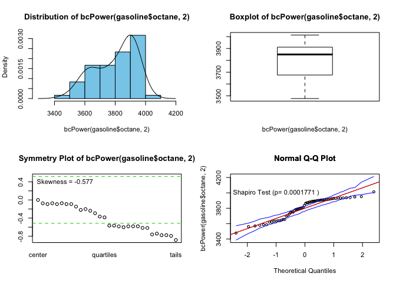
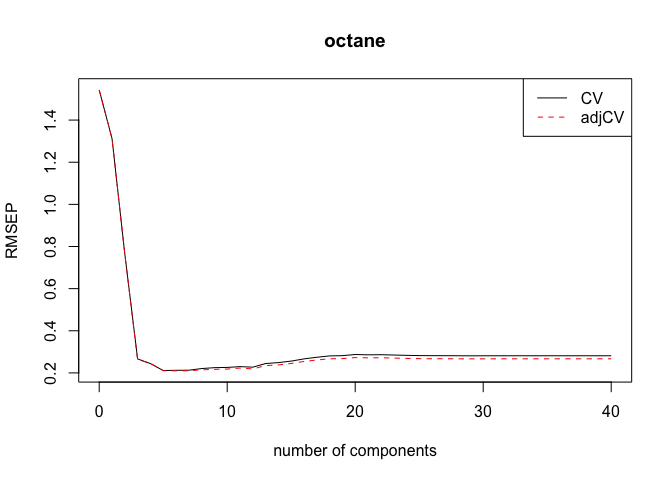

# NIR Octane

- [Correlation structure](#Correlation-structure)
- [Principal Component Regression](#Principal-Component-Regression)
- [Check optimal number of component predictions](#Check-optimal-number-of-component-predictions)
- [PCR Loadings](#PCR-Loadings)
- [Fitting final PCR model](#Fitting-final-PCR-model)

- [Partial Least Squares Regression (PLS)](#Partial-Least-Squares-Regression-(PLS))
- [PLS Loadings](#PLS-Loadings)
- [Fitting final PLS model](#Fitting-final-PLS-model)

- [Monte Carlo Cross Validation](#Monte-Carlo-Cross-Validation)
- [PCR](#PCR)
- [PLS](#PLS)
- [Final Model Compatison](#Final-Model-Comparison)


``` r
setwd("~/OneDrive - MNSCU/myGithub/Supervised_Learning/Multiple_Linear_Regression/MachineLearning-SupervisedLearning/PrincipalComponentRegression")
data(gasoline)
```


``` r
gasoline.x = gasoline$NIR
dim(gasoline.x)
```

    ## [1]  60 401

``` r
matplot(t(gasoline.x),type="l",xlab="Variable",ylab="Spectral Intensity")
title(main="Spectral Readings for Gasoline Data")
```



The graph above shows how the value of spectral intensity changes based
on the variables in the data.

Correlation structure
=====================

``` r
pairs.plus(gasoline.x[,1:10])
```



``` r
pairs.plus(gasoline.x[,201:210])
```


``` r
pairs.plus(gasoline.x[,301:310]) 
```



As the variables are very higly correlated (&gt; .94), our principal
components will help reduce the dimentionality of the data. This is
depicted by the scatterplot matrices generated above with the
pairs.plus() function. Those are very higly correlated with each other
and we are going to use princiapl components and partial least squares
in predicting our response as they will make sure that we are not
redundant in fitting the model.

``` r
#Explore the response variable
par(mfrow=c(1,1))
hist(gasoline$octane)
```



``` r
Statplot(gasoline$octane)
```



``` r
BCtran(gasoline$octane)
```



``` r
Statplot(bcPower(gasoline$octane, 2))
```



There is not much skewness prevailing. When aplpying a suggested optimal
lambda=2 Box-Cox transformation, the skewness hasn’t changed that much
to apply the transformation on the response (octane).

Principal Component Regression
==============================

``` r
oct.pcr=pcr(octane~scale(NIR),data=gasoline,ncomp=40,validation="CV")
summary(oct.pcr)
```

    ## Data:    X dimension: 60 401 
    ##  Y dimension: 60 1
    ## Fit method: svdpc
    ## Number of components considered: 40
    ## 
    ## VALIDATION: RMSEP
    ## Cross-validated using 10 random segments.
    ##        (Intercept)  1 comps  2 comps  3 comps  4 comps  5 comps  6 comps
    ## CV           1.543    1.531    1.471   0.4309   0.2651   0.2279   0.2063
    ## adjCV        1.543    1.526    1.466   0.3744   0.2639   0.2263   0.2021
    ##        7 comps  8 comps  9 comps  10 comps  11 comps  12 comps  13 comps
    ## CV      0.2151   0.2197   0.2146    0.2211    0.2249    0.2163    0.2186
    ## adjCV   0.2133   0.2201   0.2116    0.2180    0.2219    0.2127    0.2151
    ##        14 comps  15 comps  16 comps  17 comps  18 comps  19 comps
    ## CV       0.2214    0.2258    0.2299    0.2449    0.2474    0.2390
    ## adjCV    0.2181    0.2226    0.2263    0.2410    0.2428    0.2337
    ##        20 comps  21 comps  22 comps  23 comps  24 comps  25 comps
    ## CV       0.2375    0.2456    0.2423    0.2384    0.2407    0.2412
    ## adjCV    0.2319    0.2402    0.2377    0.2352    0.2348    0.2353
    ##        26 comps  27 comps  28 comps  29 comps  30 comps  31 comps
    ## CV       0.2403    0.2551    0.2456    0.2399    0.2356    0.2327
    ## adjCV    0.2335    0.2490    0.2402    0.2349    0.2313    0.2302
    ##        32 comps  33 comps  34 comps  35 comps  36 comps  37 comps
    ## CV       0.2341    0.2343    0.2369    0.2468    0.2406    0.2410
    ## adjCV    0.2294    0.2289    0.2306    0.2385    0.2328    0.2332
    ##        38 comps  39 comps  40 comps
    ## CV       0.2496    0.2495    0.2573
    ## adjCV    0.2419    0.2415    0.2491
    ## 
    ## TRAINING: % variance explained
    ##         1 comps  2 comps  3 comps  4 comps  5 comps  6 comps  7 comps
    ## X        71.725    88.57    93.74    97.51    98.28    98.67    99.01
    ## octane    8.856    22.69    96.39    97.40    98.18    98.51    98.51
    ##         8 comps  9 comps  10 comps  11 comps  12 comps  13 comps  14 comps
    ## X         99.20    99.36     99.48     99.57     99.64     99.70     99.74
    ## octane    98.57    98.79     98.79     98.81     98.88     98.88     98.88
    ##         15 comps  16 comps  17 comps  18 comps  19 comps  20 comps
    ## X          99.78     99.81     99.83     99.85     99.86     99.88
    ## octane     98.88     98.93     98.93     99.00     99.05     99.08
    ##         21 comps  22 comps  23 comps  24 comps  25 comps  26 comps
    ## X          99.89     99.90     99.91     99.92     99.93     99.94
    ## octane     99.10     99.12     99.13     99.21     99.24     99.28
    ##         27 comps  28 comps  29 comps  30 comps  31 comps  32 comps
    ## X          99.94     99.95     99.95     99.95     99.96     99.96
    ## octane     99.30     99.33     99.36     99.37     99.38     99.47
    ##         33 comps  34 comps  35 comps  36 comps  37 comps  38 comps
    ## X          99.96     99.97     99.97     99.97     99.98     99.98
    ## octane     99.51     99.55     99.60     99.61     99.62     99.62
    ##         39 comps  40 comps
    ## X          99.98     99.98
    ## octane     99.64     99.64

Based on the CV RMSEP, it is optimal to retain 6 principal components
(19.72%).

``` r
gasoline.train = gasoline[1:50,]
gasoline.test = gasoline[51:60,]
attributes(gasoline.train)
```

    ## $names
    ## [1] "octane" "NIR"   
    ## 
    ## $row.names
    ##  [1] "1"  "2"  "3"  "4"  "5"  "6"  "7"  "8"  "9"  "10" "11" "12" "13" "14"
    ## [15] "15" "16" "17" "18" "19" "20" "21" "22" "23" "24" "25" "26" "27" "28"
    ## [29] "29" "30" "31" "32" "33" "34" "35" "36" "37" "38" "39" "40" "41" "42"
    ## [43] "43" "44" "45" "46" "47" "48" "49" "50"
    ## 
    ## $class
    ## [1] "data.frame"

``` r
dim(gasoline.train$NIR)
```

    ## [1]  50 401

Check optimal number of component predictions
=============================================

Let’s explore the optimal number of components further with our oct.pcr
model, where we are considering within ncomp=40.

``` r
#10 components
ypred = predict(oct.pcr, ncomp = 11, newdata = gasoline.test)
paste("RMSEP for testing:", sqrt(mean(ypred-gasoline.test$octane)^2))
```

    ## [1] "RMSEP for testing: 0.0180920986810605"

``` r
#9 components
ypred = predict(oct.pcr, ncomp = 9, newdata = gasoline.test)
paste("RMSEP for testing, 9PCs:", sqrt(mean(ypred-gasoline.test$octane)^2))
```

    ## [1] "RMSEP for testing, 9PCs: 0.0256621310600451"

``` r
#7 components
ypred = predict(oct.pcr, ncomp = 7, newdata = gasoline.test)
paste("RMSEP for testing, 7PCs:", sqrt(mean(ypred-gasoline.test$octane)^2))
```

    ## [1] "RMSEP for testing, 7PCs: 0.000898561170103562"

``` r
#6 components
ypred = predict(oct.pcr, ncomp = 6, newdata = gasoline.test)
paste("RMSEP for testing, 6PCs:", sqrt(mean(ypred-gasoline.test$octane)^2))
```

    ## [1] "RMSEP for testing, 6PCs: 0.000887087398619712"

``` r
#5 components
ypred = predict(oct.pcr, ncomp = 5, newdata = gasoline.test)
paste("RMSEP for testing, 5PCs:", sqrt(mean(ypred-gasoline.test$octane)^2))
```

    ## [1] "RMSEP for testing, 5PCs: 0.0274881902636182"

``` r
#4 components
ypred = predict(oct.pcr, ncomp = 4, newdata = gasoline.test)
paste("RMSEP for testing, 4PCs:", sqrt(mean(ypred-gasoline.test$octane)^2))
```

    ## [1] "RMSEP for testing, 4PCs: 0.0945304325000407"

Optimal number of components to retain is 6, indeed, 6.

PCR Loadings
============

Let’s examine the loadings on the components you used in your model.

``` r
loadingplot(oct.pcr,comps=1:2,lty=1:2,lwd=2,legendpos="topright")
```


Each pc comnponent takes pieces of variables. The loadings plot above
depicts which component takes in which ranges of pieces of variables.
PC1 contains pieces of variables 110-120 and 350-400. PC2 is similar to
PC1 but it puts more emphasis on variables 110-120 and 350-400 than PC1.
PC2 also contains a lot information about some of the 170-230 variables.

Fitting final PCR model
=======================

Using the optimal number of components chosen above, we’re fitting the
model to these training data and predicting the octane of the test cases
using their NIR spectra.

We picked ncomp=6.

``` r
oct.train = pcr(octane~scale(NIR),data=gasoline.train,ncomp=6)
```

Assuming you have already built a model to the training data set do the
following to obtain the predicted octanes for the observations in the
test set.

Let’s see how the model oct.train, that was fir with ncomp=6, predicts
on the test set with ncomp=6.

``` r
ypred = predict(oct.train,ncomp=6,newdata=gasoline.test)
yact = gasoline.test$octane
paste("RMSEP:", sqrt(mean((ypred-yact)^2)))
```

    ## [1] "RMSEP: 0.172179304321268"

Partial Least Squares Regression (PLS)
======================================

Now, we are using the plsr() function.

``` r
oct.pls = plsr(octane~scale(NIR),data=gasoline,ncomp=40,validation="CV")
summary(oct.pls)
```

    ## Data:    X dimension: 60 401 
    ##  Y dimension: 60 1
    ## Fit method: kernelpls
    ## Number of components considered: 40
    ## 
    ## VALIDATION: RMSEP
    ## Cross-validated using 10 random segments.
    ##        (Intercept)  1 comps  2 comps  3 comps  4 comps  5 comps  6 comps
    ## CV           1.543    1.312   0.7641   0.2664   0.2443   0.2113   0.2123
    ## adjCV        1.543    1.313   0.7632   0.2628   0.2459   0.2106   0.2098
    ##        7 comps  8 comps  9 comps  10 comps  11 comps  12 comps  13 comps
    ## CV      0.2128   0.2207   0.2249    0.2261    0.2298    0.2273    0.2444
    ## adjCV   0.2101   0.2146   0.2169    0.2183    0.2230    0.2190    0.2345
    ##        14 comps  15 comps  16 comps  17 comps  18 comps  19 comps
    ## CV       0.2489    0.2561    0.2666    0.2743    0.2806    0.2819
    ## adjCV    0.2380    0.2450    0.2543    0.2613    0.2670    0.2679
    ##        20 comps  21 comps  22 comps  23 comps  24 comps  25 comps
    ## CV       0.2873    0.2859    0.2864    0.2849    0.2833    0.2822
    ## adjCV    0.2728    0.2714    0.2719    0.2704    0.2689    0.2677
    ##        26 comps  27 comps  28 comps  29 comps  30 comps  31 comps
    ## CV       0.2818    0.2817    0.2814    0.2811    0.2812    0.2813
    ## adjCV    0.2673    0.2673    0.2669    0.2667    0.2668    0.2669
    ##        32 comps  33 comps  34 comps  35 comps  36 comps  37 comps
    ## CV       0.2813    0.2814    0.2814    0.2814    0.2814    0.2814
    ## adjCV    0.2669    0.2669    0.2669    0.2669    0.2669    0.2669
    ##        38 comps  39 comps  40 comps
    ## CV       0.2814    0.2814    0.2814
    ## adjCV    0.2669    0.2669    0.2669
    ## 
    ## TRAINING: % variance explained
    ##         1 comps  2 comps  3 comps  4 comps  5 comps  6 comps  7 comps
    ## X         64.97    83.51    93.72    96.33    98.21    98.58    98.81
    ## octane    30.54    79.79    97.73    98.27    98.67    98.90    99.05
    ##         8 comps  9 comps  10 comps  11 comps  12 comps  13 comps  14 comps
    ## X         98.89    99.02     99.19     99.44     99.49     99.55     99.60
    ## octane    99.29    99.44     99.53     99.57     99.69     99.76     99.83
    ##         15 comps  16 comps  17 comps  18 comps  19 comps  20 comps
    ## X          99.69     99.72     99.76     99.78     99.81     99.83
    ## octane     99.86     99.90     99.93     99.95     99.97     99.99
    ##         21 comps  22 comps  23 comps  24 comps  25 comps  26 comps
    ## X          99.85     99.87     99.88     99.89      99.9     99.91
    ## octane     99.99     99.99    100.00    100.00     100.0    100.00
    ##         27 comps  28 comps  29 comps  30 comps  31 comps  32 comps
    ## X          99.91     99.92     99.93     99.93     99.94     99.94
    ## octane    100.00    100.00    100.00    100.00    100.00    100.00
    ##         33 comps  34 comps  35 comps  36 comps  37 comps  38 comps
    ## X          99.95     99.96     99.96     99.96     99.96     99.97
    ## octane    100.00    100.00    100.00    100.00    100.00    100.00
    ##         39 comps  40 comps
    ## X          99.97     99.97
    ## octane    100.00    100.00

Based on the CV RMSEP, it is optimal to retain 5 principal components
(20.56%).

``` r
plot(RMSEP(oct.pls), legendpos = "topright",)
```



It looks like the optimal number of components is somewhere between 4-6.

Let’s ecplore choosing the optimal number of components further.

``` r
#4 components
ypred = predict(oct.pls, ncomp = 4, newdata = gasoline.test)
paste("RMSEP for testing, 4PCs:", sqrt(mean(ypred-gasoline.test$octane)^2))
```

    ## [1] "RMSEP for testing, 4PCs: 0.141324145004918"

``` r
#5 components
ypred = predict(oct.pls, ncomp = 5, newdata = gasoline.test)
paste("RMSEP for testing, 5PCs:", sqrt(mean(ypred-gasoline.test$octane)^2))
```

    ## [1] "RMSEP for testing, 5PCs: 0.00365425120471343"

``` r
#6 components
ypred = predict(oct.pls, ncomp = 6, newdata = gasoline.test)
paste("RMSEP for testing, 6PCs:", sqrt(mean(ypred-gasoline.test$octane)^2))
```

    ## [1] "RMSEP for testing, 6PCs: 0.00699294540983573"

Based on the above using 5 components yields lowest RMSEP.

We picked ncomp=5.

``` r
oct.train.pls = plsr(octane~scale(NIR),data=gasoline.train,ncomp=5)
```

Let’s see how the model oct.train.pls, that was fit with ncomp=5,
predicts on the test set with ncomp=5.

``` r
ypred = predict(oct.train.pls,ncomp=5,newdata=gasoline.test)
yact = gasoline.test$octane
paste("RMSEP:", sqrt(mean((ypred-yact)^2)))
```

    ## [1] "RMSEP: 0.443601936176341"

However, ncomp=4 is also worth exploring further in Monte Carlo
Cross-Validation (PART H) as we are getting RMSEP=.44.

``` r
oct.train.pls = plsr(octane~scale(NIR),data=gasoline.train,ncomp=4)
```

Let’s see how the model oct.train.pls, that was fit with ncomp=4,
predicts on the test set with ncomp=4.

``` r
ypred = predict(oct.train.pls,ncomp=4,newdata=gasoline.test)
yact = gasoline.test$octane
paste("RMSEP:", sqrt(mean((ypred-yact)^2)))
```

    ## [1] "RMSEP: 0.182541871464115"

ncomp=4, yileds RMSEP=.18.

PLS Loadings
============

Let’s examine the loadings on the components you used in your model.

``` r
loadingplot(oct.pls,comps=1:2,legendpos="topright")
```


The two components explain about 88% of total variation (PC1=.65,
PC2=.19). Here, PC1 is pretty similar to the loadings when we used pcr,
with a bit more empahsis on the variables 360-400. Also it contains more
informaiton about pieces of variables between 110-120. PC2, here, puts a
lot emphasis on variables 170-230 as well as 350-360; it doesn’t
emphasize variables &gt;350 as much as PC1 on this figure (or PC2 from
loadings of pcr).

Fitting final PLS model
=======================

``` r
mymodel = plsr(octane~scale(NIR),data=gasoline.train,ncomp=4)
```

``` r
ypred = predict(mymodel,ncomp=4,newdata=gasoline.test)
yact = gasoline.test$octane
paste("RMSEP:",sqrt(mean((ypred-yact)^2)))
```

    ## [1] "RMSEP: 0.182541871464115"

Monte Carlo Cross Validation
============================

Let’s estimate the RMSEP using Monte Carlo Cross-Validation (MCCV) using
p=.80 for both PLS and PCR.

The code for the function pls.cv is shown below. It takes the X’s, the
response y, and the number of components to use in the PLS fit as the
required arguments. Note the function computes RMSEP for each MC sample.
The code for the pcr.cv function is right after it.

``` r
pls.cv = function(X,y,ncomp=5,p=.667,B=100) {
    n = length(y)
    X = scale(X)
data = data.frame(X,y)
cv <- rep(0,B)
for (i in 1:B) {
ss <- floor(n*p)
sam <- sample(1:n,ss,replace=F)
fit2 <- plsr(y~.,ncomp=ncomp,data=data[sam,])
ynew <- predict(fit2,ncomp=ncomp,newdata=data[-sam,])
cv[i] <- sqrt(mean((y[-sam]-ynew)^2,na.rm=T))
}
cv
}
```

``` r
pcr.cv = function(X,y,ncomp=6,p=.667,B=100) {
    n = length(y)
    X = scale(X)
data = data.frame(X,y)
cv <- rep(0,B)
for (i in 1:B) {
ss <- floor(n*p)
sam <- sample(1:n,ss,replace=F)
#fit2 <- plsr(y~.,ncomp=ncomp,data=data[sam,])
fit2 <- pcr(y~., ncomp=ncomp, data = data[sam,])
ynew <- predict(fit2,ncomp=ncomp,newdata=data[-sam,])
cv[i] <- sqrt(mean((y[-sam]-ynew)^2,na.rm=T))
}
#check = return(data.frame(RMSEP=cv))
cv
}
```

PCR
===

The final optimal number of components we chose for our Principal
Component Regression model is ncomp=6.

``` r
final.pcr.cv = pcr.cv(gasoline$NIR, gasoline$octane, ncomp = 6, p=.80, B=1000)
mean(final.pcr.cv)
```

    ## [1] 0.2164427

PLS
===

The final optimal number of components we chose for our Partial Least
Squares Regression model is ncomp=5.

We ran the Monte Carlo Cross-Validation multiple times with ncomp=4 and
ncomp=5 and the best results with least variance were when we used 5
components to fir out plsr model.

``` r
final.pls.cv = pls.cv(gasoline$NIR, gasoline$octane, ncomp = 5 , p=.80, B=1000)
mean(final.pls.cv)
```

    ## [1] 0.2125707

Final Model Comparison
======================

``` r
df = data.frame(PCR.RMSEP = mean(final.pcr.cv), PLS.RMSEP = mean(final.pls.cv))
df
```

    ##   PCR.RMSEP PLS.RMSEP
    ## 1 0.2164427 0.2125707

Comparing our final PCR and PLS models, PLS performed slightly better.
