Genetic Marker Intensity Measurments
====================================


``` r
#setwd("~/OneDrive - MNSCU/myGithub/Statistics/Regression_models/Multiple_Linear_Regression/MLR-ACE-AVAS-MARS/Shrinkage_Methods")
#Data prep
lu = read.csv("Lu2004.csv")
X = scale(model.matrix(Age~., data = lu)[,-1])
#Xs = scale(X)
y = lu$Age
```

This data consits of n=30 subjects and 403 columns that represent
genetic marker intensity measurments for 403 different genes.

``` r
#Explore the response variable
par(mfrow=c(1,1))
hist(lu$Age)
```

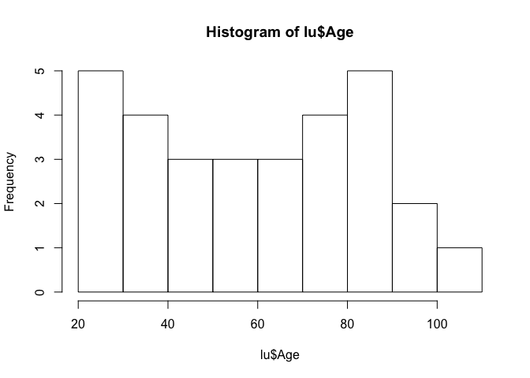

``` r
Statplot(y)
```

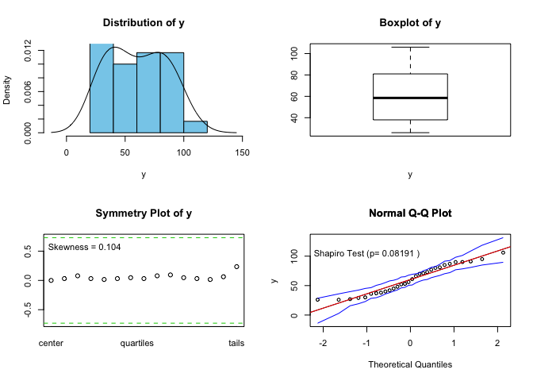

``` r
BCtran(lu$Age)
```

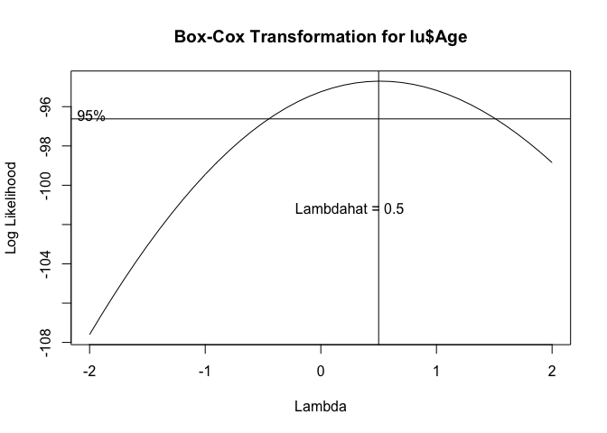

``` r
y.trans = bcPower(lu$Age, 0.5)
Statplot(y.trans)
```

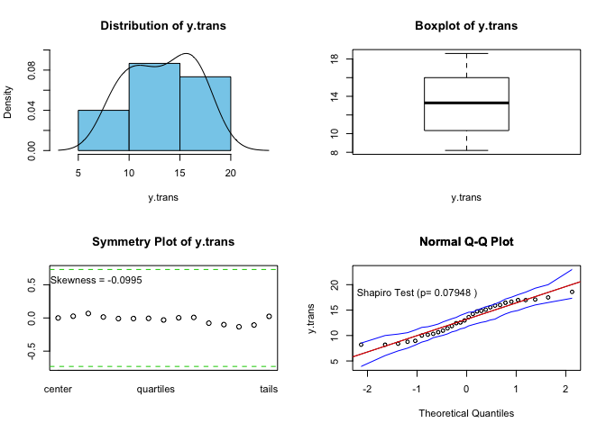

Sequence of ridge, Lasso, Elastic Net regression models with ‘grid’ values.
---------------------------------------------------------------------------

``` r
grid = 10^seq(10,-2,length = 200)
par(mfrow=c(3,2))
#ridge
ridge.mod = glmnet(X,y,alpha=0,lambda=grid)
plot(ridge.mod)
title(main ="Coefficient Shrinkage using Ridge Regression Model")
plot(ridge.mod,xvar="lambda")
title(main ="Coefficient Shrinkage using Ridge Regression Model")

#lasso
lasso.mod = glmnet(X,y,alpha=1,lambda=grid)
plot(lasso.mod)
```

    ## Warning in regularize.values(x, y, ties, missing(ties)): collapsing to
    ## unique 'x' values

``` r
title(main ="Coefficient Shrinkage using Lasso Regression Model")
plot(lasso.mod, xvar = "lambda")
title(main ="Coefficient Shrinkage using Lasso Regression Model")
#elastic
en.mod = glmnet(X,y,alpha=0.5, lambda = grid)
plot(en.mod)
```

    ## Warning in regularize.values(x, y, ties, missing(ties)): collapsing to
    ## unique 'x' values

``` r
title(main ="Coefficient Shrinkage using Elastic Net Regression Model")
plot(en.mod,xvar="lambda")
title(main ="Coefficient Shrinkage using Elastic Net Regression Model")
```

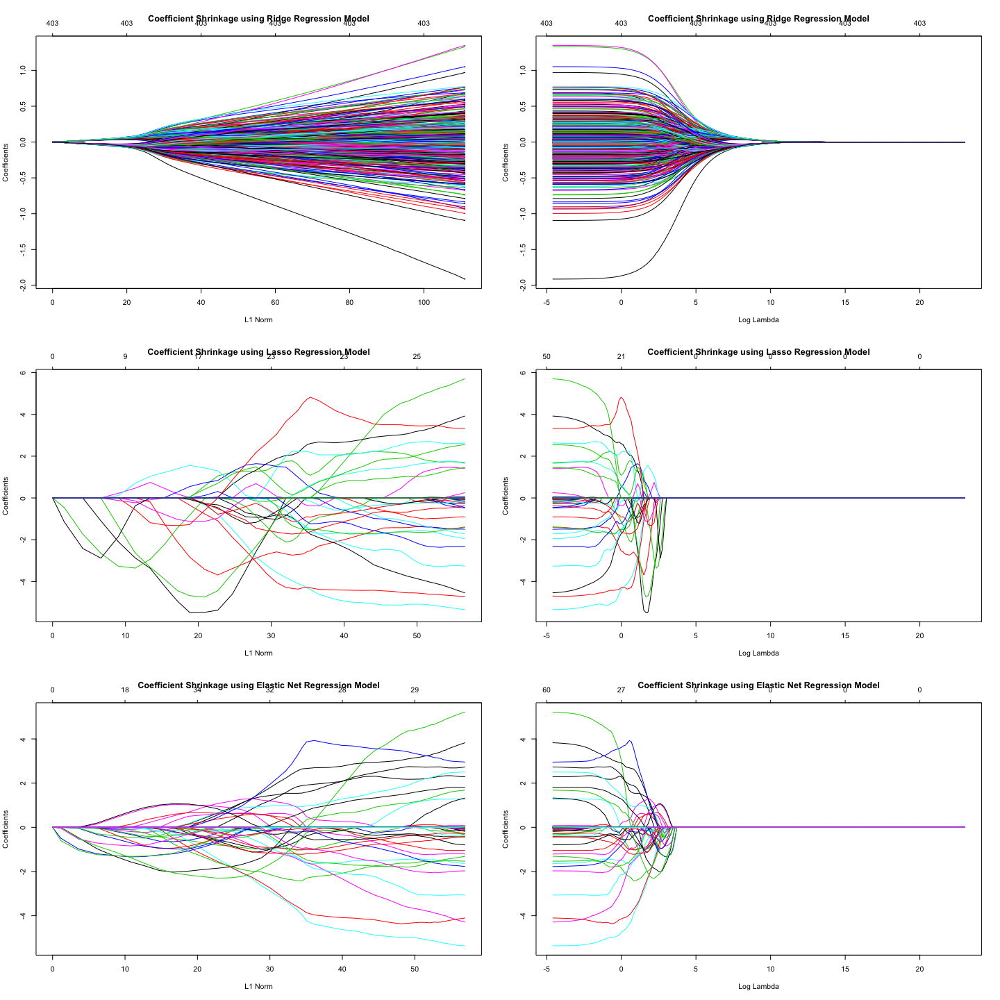

In the figures above, we will focus on the Log Lambda scale - 3 graphs
in 2nd column, reading top to bottom. The higher the Log lambda, the
closer we are to OLS plot. Ridge method, 1st row: it seems to have a
couple (a few) of very important variables streching to the sides.
Log(lambda) is going to be between 4-6 just by looking at this graph.

Lasso mehtod, 2nd row: we see more important variables, and a lot of
them that are around coefficient value = 0 are irrelevant; it looks like
Lasso turned this model into a bunch of very useful variables
vs. irrelevant ones.

Third row, in terms of interpretibality, Elastic Net looks similiar to
Lasso.

We can say that higher values (larger positives or larger negatives) of
coefficients of those genes are more useful in determining the age of
the subject. Without further information about gene functions, we cannot
interpret how the relevant genetic marker intensity measurments - chosen
by our model - relate to predicting the age of the subject.
Nevertheless, thanks to the model, we know which such genes are most
related/useful.

In the next steps, we are going to find best predicting method by
comparing the three regression shrinkage methods: ridge, Lasso, and
Elastic Net.

Optimal lambda for ridge, Lasso, Elastic Net
--------------------------------------------

Finding lambda for ridge, Lasso, and Elastic Net regression using the
cv.glmnet function - including plots of the cross-validation results for
all methods.

``` r
#Ridge regression
par(mfrow=c(1,2))
cv.ridge= cv.glmnet(X, y, alpha = 0)
bestlam.ridge = cv.ridge$lambda.min
plot(cv.ridge)
title(main = paste("Best log(lambda) for Ridge", (round(log(bestlam.ridge),digits = 2))), sub = paste("Best lambda:", round(bestlam.ridge)))
#ridge.results = glmnet.ssmc(X,y, p=.75, M=1000,alpha=0,lambda=bestlam.ridge)

#Transformed resposne ridge regression
y.back.trans = invBoxCox(y.trans, 0.5)
cv.ridge.trans= cv.glmnet(X, y.trans, alpha = 0)
bestlam.ridge.trans = cv.ridge.trans$lambda.min
plot(cv.ridge.trans)
title(main = paste("Best log(lambda) for Ridge with transformed resposne", (round(log(bestlam.ridge.trans), digits = 2))), sub = paste("Best lambda:", round(bestlam.ridge.trans)))
```

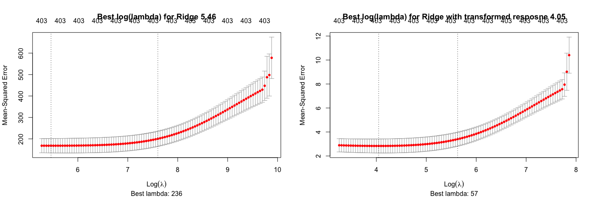

``` r
#ridge.trans.results = glmnet.ssmc(X,y.back.trans,p=.75,M=1000,alpha=0,lambda=bestlam.ridge.log)
```

The optimal lambda found by cv.glmnet function is shown in the plots
above. The vertical dashed lines across the entire graphic represent
lower bound and upper bound limits of optimal lambda values. The optimal
(minimal) lambda value has the lowest Mean Squared Erroe (MSE). For when
the response variable (age) is in its origina scale, best lambda is
log(5.93); when the response is transformed, best log(lambda) is 4.09.
Log(lambda) is displayed for comparison purposes to the x-axis on the
graphs. At the bottom of the plots, the actual value of best lambda is
displayed.

The above regards as well the two following figures for Lasso and
Elastic Net methods.

``` r
par(mfrow=c(1,2))
#Lasso regression
cv.lasso = cv.glmnet(X, y, alpha = 1)
bestlam.lasso = cv.lasso$lambda.min
plot(cv.lasso)
title(main = paste("Best log(lambda) for Lasso", (round(log(bestlam.lasso),digits = 4))), sub = paste("Best lambda:", round(bestlam.lasso, 4)))


#lasso.results = glmnet.ssmc(X,y,p=.75, M=1000,alpha=1,lambda=bestlam.lasso)

#Transformed response lasso 
cv.lasso.trans = cv.glmnet(X, y.trans, alpha = 1)
bestlam.lasso.trans = cv.lasso.trans$lambda.min
plot(cv.lasso.trans)
title(main = paste("Best log(lambda) for Lasso with transformed resposne", (round(log(bestlam.lasso.trans),digits = 4))), sub = paste("Best lambda:", round(bestlam.lasso.trans,4)))
```

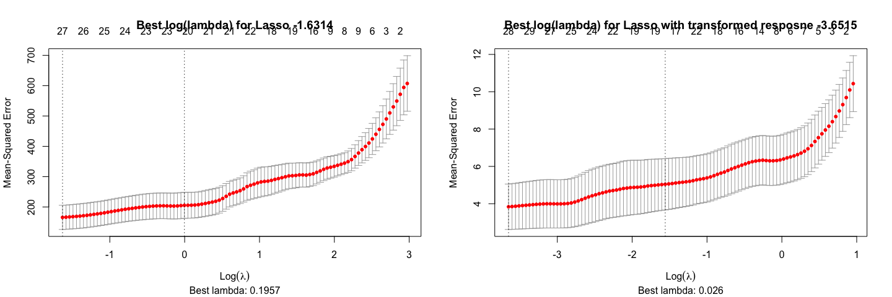

``` r
#lasso.trans.results = glmnet.ssmc(X,y.back.trans,p=.75,M=1000,alpha=1,lambda=bestlam.lasso.trans)
#basing it on MAPE, we're choosing the log reposne
```

``` r
par(mfrow=c(1,2))
#Elastic net
cv.en = cv.glmnet(X,y,alpha=0.15)
bestlam.en = cv.en$lambda.min
plot(cv.en)
title(main = paste("Best log(lambda) for Elastic Net", (round(log(bestlam.en),digits = 2))), sub = paste("Best lambda:", round(bestlam.en,4)))
#en.results = glmnet.ssmc(X,y,p=.75, M=1000,alpha=0.1,lambda=bestlam.en)

#Transformed response en 
cv.en.trans = cv.glmnet(X,y.trans,alpha=0.15)
bestlam.en.trans = cv.en.trans$lambda.min
plot(cv.en.trans)
title(main = paste("Best log(lambda) for Elastic Net with response transformed", (round(log(bestlam.en.trans),digits = 2))), sub = paste("Best lambda:", round(bestlam.en.trans,4)))
```

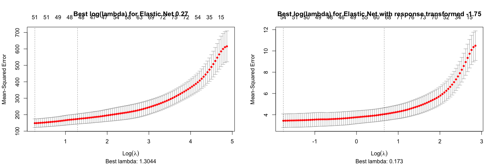

``` r
#en.trans.results = glmnet.ssmc(X,y.back.trans, M=1000,alpha=0.1,lambda=bestlam.en.trans)
```

Fit the optimal ridge, Lasso, and Elastic Net regression models and construct plots of the predicted ages (y ̂) vs. actual age (y)
---------------------------------------------------------------------------------------------------------------------------------

``` r
par(mfrow=c(3,1))

ridge.mod = glmnet(X,y,alpha=0,lambda=bestlam.ridge)
#y and yhat correlation
ridge.cor = cor(y, predict(ridge.mod, newx = X))
#y and yhat correlation^2 = R^2
ridge.rsqaured = cor(y, predict(ridge.mod, newx = X))^2
plot(y,predict(ridge.mod,newx=X),xlab="Actual Age (y-values)",ylab="Predicted Age (yhat-values)", main = paste("Ridge Model:", "   ", "Correlation:", round(ridge.cor,4), "   ", "R^2:", round(ridge.rsqaured,4)))


lasso.mod = glmnet(X,y,alpha=1,lambda=bestlam.lasso)
#y and yhat correlation
lasso.cor = cor(y, predict(lasso.mod, newx = X))
#y and yhat correlation^2 = R^2
lasso.rsqaured = cor(y, predict(lasso.mod, newx = X))^2
plot(y,predict(lasso.mod,newx=X),xlab="Actual Age (y-values)",ylab="Predicted Age (yhat-values)", main = paste("Lasso Model:", "   ", "Correlation:", round(lasso.cor,4), "   ", "R^2:", round(lasso.rsqaured,4)))

en.mod = glmnet(X,y,alpha=0.15, lambda =bestlam.en)
#y and yhat correlation
en.cor = cor(y, predict(en.mod, newx = X))
#y and yhat correlation^2 = R^2
en.rsqaured = cor(y, predict(en.mod, newx = X))^2
plot(y,predict(en.mod,newx=X),xlab="Actual Age (y-values)",ylab="Predicted Age (yhat-values)", main = paste("Elastic Net Model:", "   ", "Correlation:", round(en.cor,4), "   ", "R^2:", round(en.rsqaured,4)))
```

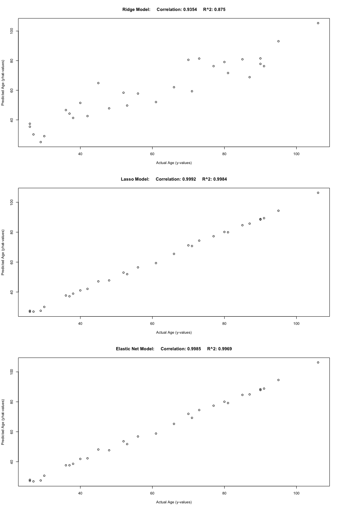

The best model predicting age by far is the Elastic Net model with
lambda = 1.96 (bestlam.en). However, as we will see later, this model
suffers from overfitting. When we perform a Monte-Carlo cross
validation, we will notice that our model is picking up the noise and
random fluctuactions in the data that it performs in it too well. We may
want to regularize the penalty term, alpha. Increasing alpha in the
elastic net model may help adjust high variance issue (alpha=0.15).

Which genes are most related or useful in determining the age of the subject?
-----------------------------------------------------------------------------

I.e., examine and interpret estimated coefficients of the model chosen
above.

``` r
#Coefficients' importance for Elastic Net
en.coef = coef(en.mod, s=bestlam.en)
en.coef[order(en.coef, decreasing = TRUE)]
```

    ## <sparse>[ <logic> ] : .M.sub.i.logical() maybe inefficient

    ##   [1] 60.26666667  3.00086581  2.67594947  2.37285732  2.16639475
    ##   [6]  1.70336986  1.69252394  1.63802613  1.22983666  1.09837412
    ##  [11]  1.06979301  0.84125334  0.63002819  0.53822136  0.41025200
    ##  [16]  0.34820909  0.21014842  0.11941388  0.09256619  0.08294133
    ##  [21]  0.05384477  0.00000000  0.00000000  0.00000000  0.00000000
    ##  [26]  0.00000000  0.00000000  0.00000000  0.00000000  0.00000000
    ##  [31]  0.00000000  0.00000000  0.00000000  0.00000000  0.00000000
    ##  [36]  0.00000000  0.00000000  0.00000000  0.00000000  0.00000000
    ##  [41]  0.00000000  0.00000000  0.00000000  0.00000000  0.00000000
    ##  [46]  0.00000000  0.00000000  0.00000000  0.00000000  0.00000000
    ##  [51]  0.00000000  0.00000000  0.00000000  0.00000000  0.00000000
    ##  [56]  0.00000000  0.00000000  0.00000000  0.00000000  0.00000000
    ##  [61]  0.00000000  0.00000000  0.00000000  0.00000000  0.00000000
    ##  [66]  0.00000000  0.00000000  0.00000000  0.00000000  0.00000000
    ##  [71]  0.00000000  0.00000000  0.00000000  0.00000000  0.00000000
    ##  [76]  0.00000000  0.00000000  0.00000000  0.00000000  0.00000000
    ##  [81]  0.00000000  0.00000000  0.00000000  0.00000000  0.00000000
    ##  [86]  0.00000000  0.00000000  0.00000000  0.00000000  0.00000000
    ##  [91]  0.00000000  0.00000000  0.00000000  0.00000000  0.00000000
    ##  [96]  0.00000000  0.00000000  0.00000000  0.00000000  0.00000000
    ## [101]  0.00000000  0.00000000  0.00000000  0.00000000  0.00000000
    ## [106]  0.00000000  0.00000000  0.00000000  0.00000000  0.00000000
    ## [111]  0.00000000  0.00000000  0.00000000  0.00000000  0.00000000
    ## [116]  0.00000000  0.00000000  0.00000000  0.00000000  0.00000000
    ## [121]  0.00000000  0.00000000  0.00000000  0.00000000  0.00000000
    ## [126]  0.00000000  0.00000000  0.00000000  0.00000000  0.00000000
    ## [131]  0.00000000  0.00000000  0.00000000  0.00000000  0.00000000
    ## [136]  0.00000000  0.00000000  0.00000000  0.00000000  0.00000000
    ## [141]  0.00000000  0.00000000  0.00000000  0.00000000  0.00000000
    ## [146]  0.00000000  0.00000000  0.00000000  0.00000000  0.00000000
    ## [151]  0.00000000  0.00000000  0.00000000  0.00000000  0.00000000
    ## [156]  0.00000000  0.00000000  0.00000000  0.00000000  0.00000000
    ## [161]  0.00000000  0.00000000  0.00000000  0.00000000  0.00000000
    ## [166]  0.00000000  0.00000000  0.00000000  0.00000000  0.00000000
    ## [171]  0.00000000  0.00000000  0.00000000  0.00000000  0.00000000
    ## [176]  0.00000000  0.00000000  0.00000000  0.00000000  0.00000000
    ## [181]  0.00000000  0.00000000  0.00000000  0.00000000  0.00000000
    ## [186]  0.00000000  0.00000000  0.00000000  0.00000000  0.00000000
    ## [191]  0.00000000  0.00000000  0.00000000  0.00000000  0.00000000
    ## [196]  0.00000000  0.00000000  0.00000000  0.00000000  0.00000000
    ## [201]  0.00000000  0.00000000  0.00000000  0.00000000  0.00000000
    ## [206]  0.00000000  0.00000000  0.00000000  0.00000000  0.00000000
    ## [211]  0.00000000  0.00000000  0.00000000  0.00000000  0.00000000
    ## [216]  0.00000000  0.00000000  0.00000000  0.00000000  0.00000000
    ## [221]  0.00000000  0.00000000  0.00000000  0.00000000  0.00000000
    ## [226]  0.00000000  0.00000000  0.00000000  0.00000000  0.00000000
    ## [231]  0.00000000  0.00000000  0.00000000  0.00000000  0.00000000
    ## [236]  0.00000000  0.00000000  0.00000000  0.00000000  0.00000000
    ## [241]  0.00000000  0.00000000  0.00000000  0.00000000  0.00000000
    ## [246]  0.00000000  0.00000000  0.00000000  0.00000000  0.00000000
    ## [251]  0.00000000  0.00000000  0.00000000  0.00000000  0.00000000
    ## [256]  0.00000000  0.00000000  0.00000000  0.00000000  0.00000000
    ## [261]  0.00000000  0.00000000  0.00000000  0.00000000  0.00000000
    ## [266]  0.00000000  0.00000000  0.00000000  0.00000000  0.00000000
    ## [271]  0.00000000  0.00000000  0.00000000  0.00000000  0.00000000
    ## [276]  0.00000000  0.00000000  0.00000000  0.00000000  0.00000000
    ## [281]  0.00000000  0.00000000  0.00000000  0.00000000  0.00000000
    ## [286]  0.00000000  0.00000000  0.00000000  0.00000000  0.00000000
    ## [291]  0.00000000  0.00000000  0.00000000  0.00000000  0.00000000
    ## [296]  0.00000000  0.00000000  0.00000000  0.00000000  0.00000000
    ## [301]  0.00000000  0.00000000  0.00000000  0.00000000  0.00000000
    ## [306]  0.00000000  0.00000000  0.00000000  0.00000000  0.00000000
    ## [311]  0.00000000  0.00000000  0.00000000  0.00000000  0.00000000
    ## [316]  0.00000000  0.00000000  0.00000000  0.00000000  0.00000000
    ## [321]  0.00000000  0.00000000  0.00000000  0.00000000  0.00000000
    ## [326]  0.00000000  0.00000000  0.00000000  0.00000000  0.00000000
    ## [331]  0.00000000  0.00000000  0.00000000  0.00000000  0.00000000
    ## [336]  0.00000000  0.00000000  0.00000000  0.00000000  0.00000000
    ## [341]  0.00000000  0.00000000  0.00000000  0.00000000  0.00000000
    ## [346]  0.00000000  0.00000000  0.00000000  0.00000000  0.00000000
    ## [351]  0.00000000  0.00000000  0.00000000  0.00000000  0.00000000
    ## [356]  0.00000000  0.00000000  0.00000000  0.00000000  0.00000000
    ## [361]  0.00000000  0.00000000  0.00000000  0.00000000  0.00000000
    ## [366]  0.00000000  0.00000000  0.00000000  0.00000000  0.00000000
    ## [371]  0.00000000  0.00000000  0.00000000 -0.01553148 -0.01632423
    ## [376] -0.07585478 -0.17224917 -0.18805410 -0.19526165 -0.21037693
    ## [381] -0.21897349 -0.23384480 -0.31642713 -0.40237746 -0.41342517
    ## [386] -0.41649807 -0.48551350 -0.58698473 -0.66213860 -0.70619995
    ## [391] -0.80569529 -0.85827941 -1.01348152 -1.04119454 -1.19892165
    ## [396] -1.20382106 -1.31704795 -1.53680307 -1.56161653 -2.07271962
    ## [401] -2.07851157 -2.29700185 -2.59284771 -4.40015090

Here is the list of the most important genes when using Elastic Net
(2-11 and 394-404):

``` r
par(mfrow=c(1,1))
important_genes_en = lu[,c(2:5, 397:404)]
names(important_genes_en)
```

    ##  [1] "X1007_s_at"                 "X1009_at"                  
    ##  [3] "X1040_s_at"                 "X1074_at"                  
    ##  [5] "X955_at"                    "X959_at"                   
    ##  [7] "X976_s_at"                  "X996_at"                   
    ##  [9] "AFFX.HSAC07.X00351_5_at"    "AFFX.HSAC07.X00351_M_at"   
    ## [11] "AFFX.HUMGAPDH.M33197_5_at"  "AFFX.HUMISGF3A.M97935_5_at"

``` r
en.mod = glmnet(X,y,alpha=0.5, lambda = grid)
plot(en.mod,xvar="lambda")
title(main ="Coefficient Shrinkage using Elastic Net Regression Model")
```

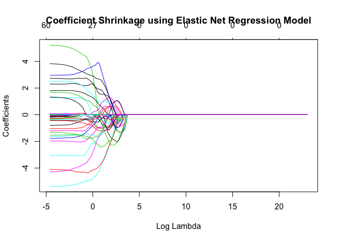

The list of the genes mentioned above is represented by the variables
that stretch to the sides the most – away from line 0.

``` r
#Coefficients' importance for Lasso
ridge.coef = coef(lasso.mod, s = bestlam.lasso)
ridge.coef[order(ridge.coef, decreasing = TRUE)]
```

    ## <sparse>[ <logic> ] : .M.sub.i.logical() maybe inefficient

    ##   [1] 60.26666667  5.24285012  3.37565193  3.34531461  2.70316414
    ##   [6]  2.17612613  2.07256832  1.69346421  1.05436732  0.87664079
    ##  [11]  0.11985334  0.00000000  0.00000000  0.00000000  0.00000000
    ##  [16]  0.00000000  0.00000000  0.00000000  0.00000000  0.00000000
    ##  [21]  0.00000000  0.00000000  0.00000000  0.00000000  0.00000000
    ##  [26]  0.00000000  0.00000000  0.00000000  0.00000000  0.00000000
    ##  [31]  0.00000000  0.00000000  0.00000000  0.00000000  0.00000000
    ##  [36]  0.00000000  0.00000000  0.00000000  0.00000000  0.00000000
    ##  [41]  0.00000000  0.00000000  0.00000000  0.00000000  0.00000000
    ##  [46]  0.00000000  0.00000000  0.00000000  0.00000000  0.00000000
    ##  [51]  0.00000000  0.00000000  0.00000000  0.00000000  0.00000000
    ##  [56]  0.00000000  0.00000000  0.00000000  0.00000000  0.00000000
    ##  [61]  0.00000000  0.00000000  0.00000000  0.00000000  0.00000000
    ##  [66]  0.00000000  0.00000000  0.00000000  0.00000000  0.00000000
    ##  [71]  0.00000000  0.00000000  0.00000000  0.00000000  0.00000000
    ##  [76]  0.00000000  0.00000000  0.00000000  0.00000000  0.00000000
    ##  [81]  0.00000000  0.00000000  0.00000000  0.00000000  0.00000000
    ##  [86]  0.00000000  0.00000000  0.00000000  0.00000000  0.00000000
    ##  [91]  0.00000000  0.00000000  0.00000000  0.00000000  0.00000000
    ##  [96]  0.00000000  0.00000000  0.00000000  0.00000000  0.00000000
    ## [101]  0.00000000  0.00000000  0.00000000  0.00000000  0.00000000
    ## [106]  0.00000000  0.00000000  0.00000000  0.00000000  0.00000000
    ## [111]  0.00000000  0.00000000  0.00000000  0.00000000  0.00000000
    ## [116]  0.00000000  0.00000000  0.00000000  0.00000000  0.00000000
    ## [121]  0.00000000  0.00000000  0.00000000  0.00000000  0.00000000
    ## [126]  0.00000000  0.00000000  0.00000000  0.00000000  0.00000000
    ## [131]  0.00000000  0.00000000  0.00000000  0.00000000  0.00000000
    ## [136]  0.00000000  0.00000000  0.00000000  0.00000000  0.00000000
    ## [141]  0.00000000  0.00000000  0.00000000  0.00000000  0.00000000
    ## [146]  0.00000000  0.00000000  0.00000000  0.00000000  0.00000000
    ## [151]  0.00000000  0.00000000  0.00000000  0.00000000  0.00000000
    ## [156]  0.00000000  0.00000000  0.00000000  0.00000000  0.00000000
    ## [161]  0.00000000  0.00000000  0.00000000  0.00000000  0.00000000
    ## [166]  0.00000000  0.00000000  0.00000000  0.00000000  0.00000000
    ## [171]  0.00000000  0.00000000  0.00000000  0.00000000  0.00000000
    ## [176]  0.00000000  0.00000000  0.00000000  0.00000000  0.00000000
    ## [181]  0.00000000  0.00000000  0.00000000  0.00000000  0.00000000
    ## [186]  0.00000000  0.00000000  0.00000000  0.00000000  0.00000000
    ## [191]  0.00000000  0.00000000  0.00000000  0.00000000  0.00000000
    ## [196]  0.00000000  0.00000000  0.00000000  0.00000000  0.00000000
    ## [201]  0.00000000  0.00000000  0.00000000  0.00000000  0.00000000
    ## [206]  0.00000000  0.00000000  0.00000000  0.00000000  0.00000000
    ## [211]  0.00000000  0.00000000  0.00000000  0.00000000  0.00000000
    ## [216]  0.00000000  0.00000000  0.00000000  0.00000000  0.00000000
    ## [221]  0.00000000  0.00000000  0.00000000  0.00000000  0.00000000
    ## [226]  0.00000000  0.00000000  0.00000000  0.00000000  0.00000000
    ## [231]  0.00000000  0.00000000  0.00000000  0.00000000  0.00000000
    ## [236]  0.00000000  0.00000000  0.00000000  0.00000000  0.00000000
    ## [241]  0.00000000  0.00000000  0.00000000  0.00000000  0.00000000
    ## [246]  0.00000000  0.00000000  0.00000000  0.00000000  0.00000000
    ## [251]  0.00000000  0.00000000  0.00000000  0.00000000  0.00000000
    ## [256]  0.00000000  0.00000000  0.00000000  0.00000000  0.00000000
    ## [261]  0.00000000  0.00000000  0.00000000  0.00000000  0.00000000
    ## [266]  0.00000000  0.00000000  0.00000000  0.00000000  0.00000000
    ## [271]  0.00000000  0.00000000  0.00000000  0.00000000  0.00000000
    ## [276]  0.00000000  0.00000000  0.00000000  0.00000000  0.00000000
    ## [281]  0.00000000  0.00000000  0.00000000  0.00000000  0.00000000
    ## [286]  0.00000000  0.00000000  0.00000000  0.00000000  0.00000000
    ## [291]  0.00000000  0.00000000  0.00000000  0.00000000  0.00000000
    ## [296]  0.00000000  0.00000000  0.00000000  0.00000000  0.00000000
    ## [301]  0.00000000  0.00000000  0.00000000  0.00000000  0.00000000
    ## [306]  0.00000000  0.00000000  0.00000000  0.00000000  0.00000000
    ## [311]  0.00000000  0.00000000  0.00000000  0.00000000  0.00000000
    ## [316]  0.00000000  0.00000000  0.00000000  0.00000000  0.00000000
    ## [321]  0.00000000  0.00000000  0.00000000  0.00000000  0.00000000
    ## [326]  0.00000000  0.00000000  0.00000000  0.00000000  0.00000000
    ## [331]  0.00000000  0.00000000  0.00000000  0.00000000  0.00000000
    ## [336]  0.00000000  0.00000000  0.00000000  0.00000000  0.00000000
    ## [341]  0.00000000  0.00000000  0.00000000  0.00000000  0.00000000
    ## [346]  0.00000000  0.00000000  0.00000000  0.00000000  0.00000000
    ## [351]  0.00000000  0.00000000  0.00000000  0.00000000  0.00000000
    ## [356]  0.00000000  0.00000000  0.00000000  0.00000000  0.00000000
    ## [361]  0.00000000  0.00000000  0.00000000  0.00000000  0.00000000
    ## [366]  0.00000000  0.00000000  0.00000000  0.00000000  0.00000000
    ## [371]  0.00000000  0.00000000  0.00000000  0.00000000  0.00000000
    ## [376]  0.00000000  0.00000000  0.00000000  0.00000000  0.00000000
    ## [381]  0.00000000  0.00000000  0.00000000  0.00000000  0.00000000
    ## [386]  0.00000000  0.00000000  0.00000000 -0.05221705 -0.34628868
    ## [391] -0.40423028 -0.43875687 -0.46270193 -0.94438897 -0.98103369
    ## [396] -1.34505486 -1.44196971 -1.51682543 -1.58717711 -2.20427330
    ## [401] -2.93989505 -4.00571053 -4.40984987 -5.08949872

The most important genes are from: 2-6 and 401-404

``` r
important_genes_lasso = lu[,c(2:6, 401:404)]
names(important_genes_lasso)
```

    ## [1] "X1007_s_at"                 "X1009_at"                  
    ## [3] "X1040_s_at"                 "X1074_at"                  
    ## [5] "X1090_f_at"                 "AFFX.HSAC07.X00351_5_at"   
    ## [7] "AFFX.HSAC07.X00351_M_at"    "AFFX.HUMGAPDH.M33197_5_at" 
    ## [9] "AFFX.HUMISGF3A.M97935_5_at"

``` r
lasso.mod = glmnet(X,y,alpha=1,lambda=grid)
plot(lasso.mod, xvar = "lambda")
title(main ="Coefficient Shrinkage using Lasso Regression Model")
```

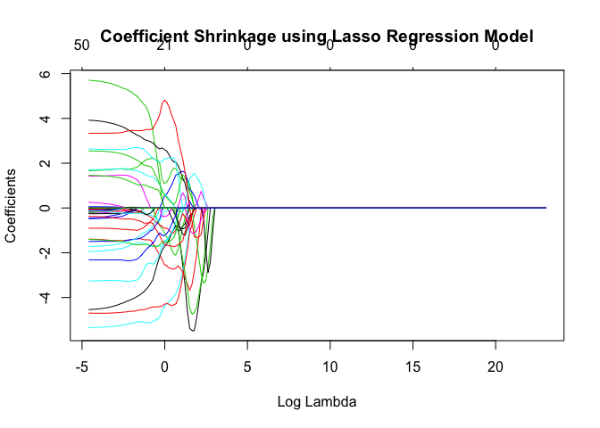

The list of the genes mentioned above is represented by the variables
that stretch to the sides the most – away from line 0.

Monte Carlo cross-validation to estimate the prediction accuracies for ridge, Lasso, and Elastic Net regression
---------------------------------------------------------------------------------------------------------------

``` r
ridge.results = glmnet.ssmc(X,y, p=.75, M=1000,alpha=0,lambda=bestlam.ridge)
```

    ## RMSEP = 12.99131   MAEP= 10.75675   MAPEP= 0.2063561

``` r
ridge.trans.results = glmnet.ssmc(X,y.back.trans,p=.75,M=1000,alpha=0,lambda=bestlam.ridge.trans)
```

    ## RMSEP = 13.35959   MAEP= 11.18002   MAPEP= 0.2159183

``` r
lasso.results = glmnet.ssmc(X,y,p=.75, M=1000,alpha=1,lambda=bestlam.lasso)
```

    ## RMSEP = 15.45582   MAEP= 13.05634   MAPEP= 0.2422399

``` r
lasso.trans.results = glmnet.ssmc(X,y.back.trans,p=.75,M=1000,alpha=1,lambda=bestlam.lasso.trans)
```

    ## RMSEP = 15.76748   MAEP= 13.38305   MAPEP= 0.2526468

``` r
en.results = glmnet.ssmc(X,y,p=.75, M=1000,alpha=0.15,lambda=bestlam.en)
```

    ## RMSEP = 14.24308   MAEP= 12.02612   MAPEP= 0.2226731

``` r
en.trans.results = glmnet.ssmc(X,y.back.trans,p=.75, M=1000,alpha=0.15,lambda=bestlam.en.trans)
```

    ## RMSEP = 14.52391   MAEP= 12.30277   MAPEP= 0.2312181

``` r
#Compare the three methods
names = c("Ridge", "Ridge Transformed", "Lasso", "Lasso Transformed", "Elastic Net", "Elastic Net Transormed")
metrics =cbind(((names)), rbind(
  do.call(cbind, lapply(ridge.results,mean)), 
  do.call(cbind, lapply(ridge.trans.results, mean)),
  do.call(cbind, lapply(lasso.results, mean)),
  do.call(cbind, lapply(lasso.trans.results, mean)),
  do.call(cbind, lapply(en.results, mean)),
  do.call(cbind, lapply(en.trans.results, mean))))
```

``` r
as.data.frame(metrics)
```

    ##                       V1            RMSEP             MAEP
    ## 1                  Ridge 12.9913066818819 10.7567459288501
    ## 2      Ridge Transformed  13.359590422558 11.1800201396517
    ## 3                  Lasso 15.4558168724758 13.0563403153155
    ## 4      Lasso Transformed 15.7674795556087 13.3830473219513
    ## 5            Elastic Net 14.2430765930625 12.0261210501935
    ## 6 Elastic Net Transormed 14.5239108785863 12.3027698271136
    ##               MAPEP
    ## 1 0.206356082294401
    ## 2 0.215918341140688
    ## 3 0.242239938268776
    ## 4 0.252646760014376
    ## 5 0.222673138891476
    ## 6 0.231218138051228

As seen above, based on MAPE to best compare across metrics from other
models, the best method was ridge and Elastic Net came in second best -
however, the Elastic Net method was very close to the Lasso method in
terms of determining the age of the subject given their genes. Recalling
our Actual vs. Predicted plots from before, Elastic Net’s fit was
outstanding; nevertheless, as seen from out cross-validation accuracy
metrics results, that model had high variance. We would further
recommend to experiment with Elastic Net hyperparameter tuning.
